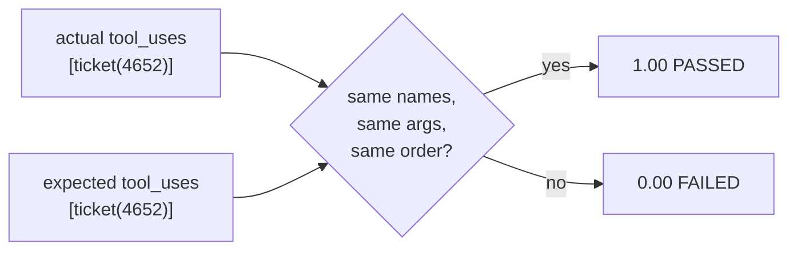

# 3.1 — tool_trajectory_avg_score — exact match on the path

## One-line answer

The metric compares the agent's tool calls against the case's, **name and arguments, in order**, and
scores 1.0 or 0.0 with nothing in between — which makes it the one assertion in an eval suite that
behaves exactly like an ordinary test, and the only one that costs no requests at any suite size.

## The story

Cutting a spare key.

You take the key to the man with the machine at the corner. He clamps yours on one side, a blank on
the other, and the cutter traces one and grinds the other. It takes two minutes.

Then you go home and try it. And there is no such thing as a key that nearly works. It turns or it does
not. There is no version of this where the door opens most of the way, or where the lock is eighty per
cent convinced. One tooth cut a fraction too deep and the key goes in, feels right, and will not turn.

That is not a limitation of keys. It is what a key **is**. The whole mechanism is built on an exact
match against a shape, and the value of it is precisely that there is no judgement anywhere in it —
nobody has to decide whether this key is good enough, because the lock decides, the same way, every
time.

## The idea in plain language

`tool_trajectory_avg_score` is the metric on the second of the three surfaces from part
[1.2](../01-a-test-with-a-score/1.2-three-surfaces-you-can-assert-on.md): the sequence of tool calls
the agent made.

`adk.dev/evaluate/` describes it in four words — *"Exact match of tool call trajectory"* — and the
name unpacks into what it does:

- **tool_trajectory** — the list of calls, each with its name and its arguments;
- **avg** — averaged across the turns of a case, so a five-turn conversation gets the mean of five
  per-turn results;
- **score** — a number, in `[0, 1]`.

Within a single turn there is no partial credit. Either the whole list matches — same calls, same
arguments, same order — or it does not. That is why the numbers you will see are `1.00` and `0.00` and
never `0.5`, and why the "average" in the name only starts to matter for multi-turn cases.

Three consequences follow and all three are worth holding.

**It costs nothing.** No model is involved. It compares two lists of structured data, so it runs in
microseconds and its request cost is zero at six cases and zero at six thousand. Part
[4.1](../04-what-it-costs-to-run/4.1-the-metrics-that-spend-nothing.md) prices the alternatives; this
is the one that stays free.

**It is deterministic.** Same inputs, same score, every run. That is rarer than it sounds in this
subject — a judged metric run twice gives two numbers — and it means a trajectory failure is always
reproducible, which is the property that makes a test debuggable.

**It has an opinion about arguments.** `ticket(ticket_id="4740")` and `ticket(ticket_id="4688")` are
different trajectories. A metric comparing only tool *names* would pass an agent that looked up the
wrong ticket and then answered about it correctly-looking-but-wrongly, and the argument comparison is
what prevents that.

ADK's own default threshold for this metric is `1.0`, from `_DEFAULT_EVAL_CONFIG` in
`google/adk/evaluation/eval_config.py` on the installed `google-adk==2.7.1`:

```text
_DEFAULT_EVAL_CONFIG = EvalConfig(
    criteria={"tool_trajectory_avg_score": 1.0, "response_match_score": 0.8}
)
```

A threshold of exactly 1.0 on a metric with no middle values is the library saying the same thing this
part is: this is not a score you tune, it is a match you demand.

## Why Sutra needs it

Because three separate claims made by earlier days live on the trajectory and nowhere else.

Day 68's least-privilege work is a claim about *which* tools get called. Day 78 priced the desk at four
requests per ticket, which is a claim about *how many*. And Day 77's ordering argument — what needs a
person is looked up first because it is said first — is a claim about the **order**, which is the one
thing only this metric can see.

The `one_lookup` case is the sharpest of the three, and its note in the fixture states the claim:

```text
the desk must not read the whole queue to answer a question about one ticket
```

That sentence is a cost claim and a data-minimisation claim at once, and there is no wording of the
answer that could ever reveal whether it holds.

## The mechanism

The whole call is three lines, and the evaluator is constructed once and reused:

```python
evaluator = TrajectoryEvaluator(threshold=THRESHOLD)
...
    result = evaluator.evaluate_invocations(
        actual_invocations=[actual], expected_invocations=[expected(case)]
    )
```

**Line by line:**

- `TrajectoryEvaluator` comes from `google.adk.evaluation.trajectory_evaluator`, and on the installed
  `google-adk==2.7.1` its signature is
  `__init__(self, threshold: Optional[float] = None, eval_metric: Optional[EvalMetric] = None)` —
  two ways to say the same thing, a bare number or a full `EvalMetric`. The bare number is used here
  because there is nothing else to configure; part
  [3.3](3.3-response-match-and-the-word-not.md) uses the `EvalMetric` form, because that evaluator's
  constructor requires it.
- It is built **outside** the loop. Constructing an evaluator per case would work and would be slower,
  and more importantly it would suggest the evaluator carries per-case state, which it does not.
- `evaluate_invocations` is a plain synchronous method. Verified against `adk.dev/evaluate/` on
  2026-09-06 and against the installed package, where it is
  `evaluate_invocations(self, actual_invocations, expected_invocations=None, conversation_scenario=None)`.
- Both arguments are lists of `Invocation`, one element per turn of the case. Every case here is one
  turn, so both lists have length one — and the metric's `avg` never gets to average anything.

Reading the result:

```python
        called = [c.name for c in actual.intermediate_data.tool_uses]
        status = result.overall_eval_status.name
        print(f"  {case.eval_id:<16}{result.overall_score:>7.2f}  {status:<8} {called}")
        if result.overall_score < THRESHOLD:
            failures += 1
```

**Line by line:**

- `result.overall_score` is the number; `result.overall_eval_status` is the `EvalStatus` enum, already
  compared against the threshold by the evaluator. Both are printed because a bare `FAILED` sends
  somebody to re-run it locally — part
  [1.1](../01-a-test-with-a-score/1.1-a-test-that-answers-how-much.md)'s review comment.
- `called` is pulled from the **actual** invocation, not from the result. The metric does not report
  *what* the agent called, only whether it matched, so the diagnostic column has to be built by the
  caller. That is a real ergonomics gap and part
  [3.2](3.2-exact-match-right-default-wrong-metric.md) is where it starts to hurt.
- `result.overall_score < THRESHOLD` re-does the comparison the evaluator already did, rather than
  reading `overall_eval_status`. Either works; comparing the score keeps the threshold visible at the
  call site, which is where a reader is looking for it.



Run the suite against the desk as designed:

```bash
cd days/day-79-evals-are-tests/lab
uv run python trajectory.py; echo "exit: $?"
```

**Line by line:**

- No flag: the desk's trajectories are exactly what the cases say, so this arm demonstrates the
  plumbing rather than the desk — part
  [2.2](../02-the-evalset-file/2.2-recording-a-case-or-writing-one.md) is why that distinction matters.

Measured on 2026-09-06:

```text
metric: tool_trajectory_avg_score, threshold 1.0
desk: as designed

  case              score  status   tools called
  counts             1.00  PASSED   ['category_counts']
  age_4740           1.00  PASSED   ['ticket']
  needs_person       1.00  PASSED   ['open_tickets']
  one_lookup         1.00  PASSED   ['ticket']
  order_matters      1.00  PASSED   ['open_tickets', 'category_counts']
  no_tool_needed     1.00  PASSED   []

  6 of 6 cases at or above 1.0
  every case took the path it was supposed to
exit: 0
```

Now inject two faults a reasonable person might introduce — read the whole queue before looking up one
ticket, and gather the standup's facts in the other order:

```bash
uv run python trajectory.py --buggy; echo "exit: $?"
```

**Line by line:**

- `--buggy` changes only `answer()`'s trajectory for two cases. The reference answers, the questions
  and the other four cases are untouched.

Measured on 2026-09-06:

```text
  case              score  status   tools called
  counts             1.00  PASSED   ['category_counts']
  age_4740           1.00  PASSED   ['ticket']
  needs_person       1.00  PASSED   ['open_tickets']
  one_lookup         0.00  FAILED   ['open_tickets', 'ticket']
  order_matters      0.00  FAILED   ['category_counts', 'open_tickets']
  no_tool_needed     1.00  PASSED   []

  4 of 6 cases at or above 1.0
  2 case(s) took a different path from the one written down
exit: 1
```

**Read the two failures as the two different bugs they are.** `one_lookup` called an *extra* tool: the
right lookup happened, plus a whole-queue read that Day 78 priced and Day 68 restricted. `order_matters`
called the *same two* tools in the *wrong order*: nothing extra, nothing missing, and it still fails —
because Day 77's argument was about order and this metric is the only one that can hold that argument.

Both score `0.00`. That is this metric's whole character: it will tell you *that* the path was wrong
and never *how much*, and the `tools called` column is doing all the diagnostic work.

## When it breaks

The metric breaks when the trajectory changes for reasons that are not bugs, and there is no error
text — just a suite that has gone red on a good day.

Three concrete ways, all of which will happen to any real agent:

**A tool gets renamed.** `open_tickets` becomes `list_open_tickets`. Every case that mentions it fails,
nothing is broken, and the diff that caused it is a rename nobody connected to the suite.

**A tool gets split or merged.** `ticket(id)` becomes `ticket_meta(id)` plus `ticket_body(id)`. Every
affected case now expects one call and sees two.

**A cache is added.** The desk remembers the queue for the length of a conversation, so the second call
never goes out. Strictly better, strictly cheaper, and it fails every multi-turn case.

In all three the output is the same shape:

```text
  one_lookup         0.00  FAILED   ['list_open_tickets']
```

and the fastest fix — deleting the trajectory assertion — is the one that costs you the three claims
this metric was carrying.

There is a second, quieter break, and part
[2.3](../02-the-evalset-file/2.3-the-case-that-cannot-fail.md) already measured it: **an empty expected
trajectory matches an agent that calls nothing**. `no_tool_needed` scores 1.00 in both arms above, and
so does every stub. On its own, this metric cannot tell a desk that correctly declined to call a tool
from a desk that has stopped calling tools altogether.

The smallest fix for the first three is not a fix to this metric — it is to assert on **properties** of
the trajectory rather than on the exact sequence, which is part
[3.2](3.2-exact-match-right-default-wrong-metric.md). The fix for the second is to pair this metric with
one on another surface, which is what `test_config.json`'s two default criteria already do.

## In production

**What a professional writes alongside it.** A second, looser trajectory assertion that survives
refactoring: *at most N calls*, *no call to any tool marked as a write*, *this tool called at least
once*. The exact-match metric stays for the handful of cases where the sequence genuinely is the
specification — Sutra's `order_matters` is one — and the property assertions carry the rest. The two do
different jobs and a suite with only the strict one gets deleted.

**What degrades at scale.** Exact trajectories are the most brittle assertion in any eval suite,
because the tool layer is the part of an agent that changes most. A suite that is 90% exact-match
trajectories will spend more engineer time on false failures than it saves, and the team's response is
predictable: they stop reading the failures. The metric is excellent and it should be a minority of
your assertions.

**The failure that only shows with real traffic.** Real trajectories are not deterministic. The same
question asked twice can produce two tool calls in one run and one in the next, because the model chose
differently. That is why `AgentEvaluator.evaluate` defaults to `num_runs=2` on the installed 2.7.1 — it
runs each case more than once — and why a trajectory case that passes locally can flake in CI. A lab
with a scripted desk cannot show you this, and it is the first thing you will meet with a real model.

**The review comment a senior engineer leaves:** *"Exact-match trajectory is right for `order_matters`
and `one_lookup` — those two cases *are* about the path, and the notes say so. For the other four,
please switch to a bound on the number of calls. When we rename a tool next quarter I want two cases to
fail, not six, and I want the two that fail to be the two where the sequence was the point."*

**The interview question:** *"How would you test that an agent uses your tools correctly?"* The answer
that shows experience compares the recorded call sequence against an expected one and then immediately
volunteers the problem: exact match is brittle under refactoring, so most cases assert properties and
only a few assert the sequence. A candidate who describes exact match with no caveat has not maintained
one for a year.

## Check yourself

```bash
cd days/day-79-evals-are-tests/lab
uv run python trajectory.py; echo "exit: $?"
uv run python trajectory.py --buggy; echo "exit: $?"
```

Both failures score exactly `0.00`, and they are two different bugs. Say what each one was, using only
the `tools called` column.

Now open `_desk.py` and change `one_lookup`'s expected argument from `{"ticket_id": "4652"}` to
`{"ticket_id": "4688"}`. Re-run the good arm. It fails — the tool name is identical and only the
argument moved. Say why that is the behaviour you want, and what an agent could do wrong that only the
argument comparison would catch.

**Out loud, without scrolling up:** this metric never returns 0.5. What does that tell you about what
it is for, and about what its threshold means?

**Next:** [3.2 — Why exact match is the right default and the wrong metric](3.2-exact-match-right-default-wrong-metric.md).
