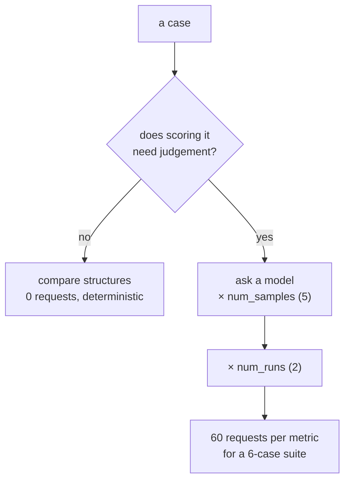

# 4.1 — The metrics that spend nothing, and the ones that spend per case

## One-line answer

ADK's thirteen prebuilt metrics split cleanly in two: the deterministic ones cost **zero requests at
any suite size**, and the judged ones cost **cases × samples × runs** — which for six cases and three
judged metrics is 180 requests, nine times the only daily allowance this repository has ever measured.

## The story

The photocopy shop with two prices on the board.

The board says one rate per page, and underneath, a second rate for colour. You bring a fifty-page
document. Black and white, that is one number and you know it before you hand the papers over. It is
arithmetic anybody can do standing at the counter.

Then somebody asks the man to check the pages first — to look through and see if any of them came out
crooked, and re-do those. He is happy to. That is not per page any more. It depends on how many pages
there are, how carefully he looks, and whether he goes through twice to be sure.

Both are reasonable services. Only one of them can be priced before it happens, and the difference is
not the paper. It is whether a person has to look at each page.

## The idea in plain language

`PrebuiltMetrics` on the installed `google-adk==2.7.1` has thirteen members. The useful way to read
that list is not alphabetically — it is by **what has to happen for one case to be scored**.

**Deterministic metrics** compare structured data. No model, no network, no variance.

- `tool_trajectory_avg_score` — two lists of tool calls, compared. Part
  [3.1](../03-two-metrics-that-cost-nothing/3.1-tool-trajectory-avg-score.md).
- `response_match_score` — ROUGE-1 word overlap. Part
  [3.3](../03-two-metrics-that-cost-nothing/3.3-response-match-and-the-word-not.md).

**Judged metrics** put a model in the loop, once per case, several times over.

- `final_response_match_v2` — a model decides whether the answer means the same as the reference.
- `rubric_based_final_response_quality_v1` and `rubric_based_tool_use_quality_v1` — a model marks the
  answer against written rubric lines. Day 80.
- `safety_v1`, `hallucinations_v1` — a model judges a property of the answer.
- the four `multi_turn_*` metrics — the same idea over a whole conversation.

The cost of a judged metric is a product, and every term in it is a default somebody chose:

```text
requests = cases × num_samples × num_runs
```

- **cases** is the size of the evalset.
- **num_samples** is how many times the judge is asked about *the same* case. On 2.7.1,
  `JudgeModelOptions.num_samples` defaults to **5**, and the field's own description says why:
  *"models tend to have certain degree of unreliability to them, we repeatedly sample them with the
  same data"*.
- **num_runs** is how many times the whole agent is re-run. `AgentEvaluator.evaluate`'s signature on
  2.7.1 has `num_runs: int = 2`.

Those two defaults multiply to **ten**. A judged metric on a six-case suite is not six requests; it is
sixty. Nobody typed a ten anywhere.

And the split is not a nuisance to be minimised — it maps onto something real. The deterministic
metrics answer questions with a definite answer (*did it call this tool?*), and the judged ones answer
questions that need a reader (*does this mean the same thing?*). You pay a model exactly when the
question requires judgement, which is a defensible line, and it is why part
[3.3](../03-two-metrics-that-cost-nothing/3.3-response-match-and-the-word-not.md)'s failure is not
fixable for free.

## Why Sutra needs it

Because [Day 78](../../../day-78-inside-free-quota/LESSON.md) established two numbers this part has to
live inside. The one allowance this repository has ever measured is **20 requests per day** for
`gemini-3.7-flash`, read off a live 429 on 2026-08-25. The lane Addendum 02 wants eval traffic on —
`gemini-2.5-flash-lite` — has **no measured allowance at all**, which is why Day 78's criterion 3
returned *cannot determine*.

So before Phase 12 can put a suite on a schedule, somebody has to do the arithmetic. This part is the
arithmetic, and it is what makes part [4.2](4.2-flash-lite-is-the-workhorse.md)'s model choice a
consequence rather than a preference.

## The mechanism

The pricing is one method on a small record. From `lab/cost.py`:

```python
@dataclass(frozen=True)
class Metric:
    name: str
    judged: bool
    note: str

    def requests(self, cases: int) -> int:
        """Requests one full pass over `cases` costs, before num_runs."""
        if not self.judged:
            return 0
        return cases * NUM_SAMPLES
```

**Line by line:**

- `judged: bool` is the only thing that matters about a metric for costing purposes, and making it a
  field rather than a lookup table means a metric added later has to declare it. A metric whose cost
  nobody stated is a metric that will be assumed free.
- `return 0` for a deterministic metric, and it is a real zero rather than a small number. ROUGE and
  trajectory comparison cost CPU and no requests, at six cases and at six thousand.
- `cases * NUM_SAMPLES` and **not** `* NUM_RUNS` — the docstring says "before num_runs" because the
  runs multiply the whole evaluation, not one metric, and folding them in here would double-count when
  several metrics are enabled.
- `NUM_SAMPLES = 5` and `NUM_RUNS = 2` are module constants with comments naming where each came from:
  `JudgeModelOptions.num_samples` and `AgentEvaluator.evaluate`'s signature, both on
  `google-adk==2.7.1`. Principle 7 applied to defaults — a number copied from a library is still a
  number that needs a source.

Run it for this day's six-case suite:

```bash
cd days/day-79-evals-are-tests/lab
uv run python cost.py
```

**Line by line:**

- No flag: six cases, the suite as it exists today. The script computes and sends nothing.

Measured on 2026-09-06:

```text
suite: 6 cases, num_runs=2 (AgentEvaluator's default)

  metric                                   req/pass  req/eval
  tool_trajectory_avg_score                       0         0
                                          compares two lists of tool calls
  response_match_score                            0         0
                                          ROUGE-1 over words; arithmetic, no model
  final_response_match_v2                        30        60
                                          a judge model, sampled 5 times per case
  rubric_based_final_response_quality_v1         30        60
                                          a judge model, per rubric line
  safety_v1                                      30        60
                                          a judge model

  every deterministic metric together: 0 requests
  every judged metric together:        180 requests
  one day's observed flash allowance:  20 requests
  flash-lite allowance:                unmeasured

  the judged metrics want 9x a day's flash allowance for one run
  which is why day 82 puts them on the nightly and on the higher-RPD model

  the two metrics this day runs cost 0 requests, at any suite size
```

**Six cases. One hundred and eighty requests.** Not because anyone is being extravagant — three judged
metrics, ADK's own sampling default, ADK's own run default. Every multiplication in that number is a
value somebody at Google chose as sensible, and the product is nine times the whole day's allowance
this repository has measured.

Now the same arithmetic on a suite the size Addendum 02 calls "full":

```bash
uv run python cost.py --grow
```

**Line by line:**

- `--grow` swaps six cases for sixty, which is Addendum 02's *"full 60+ only at phase gates"*. Nothing
  else changes: same metrics, same defaults.

Measured on 2026-09-06:

```text
  every deterministic metric together: 0 requests
  every judged metric together:        1800 requests
  one day's observed flash allowance:  20 requests
  flash-lite allowance:                unmeasured

  the judged metrics want 90x a day's flash allowance for one run
```

Ninety times. And the first line is the one to hold on to: **the deterministic column is still zero.**
It was zero at six cases and it is zero at sixty, and it would be zero at six thousand. That is not a
small advantage — it is the difference between a suite that can run on every commit and a suite that
runs when somebody remembers.



## When it breaks

The arithmetic breaks in the direction of under-counting, and it does so silently.

**A judged metric that retries.** The 180 above assumes every request succeeds. A 429 answered by Day
72's backoff sends the request again, and that retry is a request. Under quota pressure — which is
exactly when a suite is most likely to hit 429s — the real cost is higher than the plan, and it is
higher by an amount that depends on how bad the pressure is. Day 78 part 1.1's rule applies: retrying
against an exhausted daily allowance turns one failure into several and reports the last.

**`num_samples` is per metric, not per run.** Enable three judged metrics and you have three
independent sets of five samples per case. It is not five samples shared between them, which is what
the summary line "sampled 5 times per case" invites you to think.

**The rubric metrics scale with the rubric.** `rubric_based_final_response_quality_v1` is priced above
as one judged metric, and its real cost depends on how many rubric lines a case carries — which is
Day 80's subject and is not visible in this arithmetic at all. The 180 is a **lower bound**.

There is no error text for any of this. What you would see is the same 429 every over-budget system
sees, recorded by this repository on 2026-08-25:

```text
429 RESOURCE_EXHAUSTED
generativelanguage.googleapis.com/generate_content_free_tier_requests
Please retry in ~53s
```

arriving part-way through an eval run, leaving a results file with some cases scored and some marked
`NOT_EVALUATED` — which, usefully, is a real `EvalStatus` value on 2.7.1 and not something this
curriculum invented.

## In production

**What a professional does with this split.** Runs the deterministic metrics on **every commit** and
the judged ones on a **schedule**, and says so out loud in the CI config so nobody thinks a green
pull-request check means the answers were judged. Two suites, two cadences, two meanings — and the
cheap one is the one that gates merges, because a gate that costs money and time is a gate that gets
skipped.

**What degrades at scale.** The judged cost grows with the product of three things that all grow:
cases, samples and runs. Teams tune `num_samples` down to save money, which is the wrong lever — the
default is 5 because a single sample from a model is unreliable, and cutting it to 1 makes the metric
noisy in a way that produces flaky failures, which produces distrust, which produces a suite nobody
reads. The right lever is the number of judged **cases**: judge a representative subset, run the
deterministic metrics on everything.

**The failure that only shows with real traffic.** The judge is a model, so the judged metrics are
non-deterministic. The same suite run twice gives different scores, and a case sitting near its
threshold will flip. That is what `num_samples=5` exists to damp, and it damps rather than removes it.
A team that has only run deterministic metrics will read the first flake as a bug in the agent.

**The review comment a senior engineer leaves:** *"Split the config in two: `test_config.json` with
just the deterministic metrics for CI, and a second one with the judged metrics for the nightly. And
put the 180 in a comment. When somebody adds a fourth judged metric next quarter, I want the diff to
show them what they are adding, not just a line in a dictionary."*

**The interview question:** *"How much does it cost to run your eval suite?"* The answer that shows
experience gives a **formula rather than a number** — cases times samples times runs, per judged
metric — and then names the two defaults they did not choose, because those are the terms that surprise
people. A candidate who says "not much, it's just tests" has not run a judged suite against a rate
limit.

## Check yourself

```bash
cd days/day-79-evals-are-tests/lab
uv run python cost.py
uv run python cost.py --grow
```

The deterministic row is `0` in both. Say what would have to change about this system for that to stop
being true.

Now work out on paper what the six-case suite costs with two judged metrics instead of three, and with
`num_samples` at its default. Then check by editing `METRICS` in `cost.py`. If your number is 120 you
have the formula; if it is 60 you have forgotten a term.

**Out loud, without scrolling up:** where do the numbers 5 and 2 come from, and which of them did
anybody on this project choose?

**Next:** [4.2 — Flash-Lite is the workhorse, and why](4.2-flash-lite-is-the-workhorse.md).
