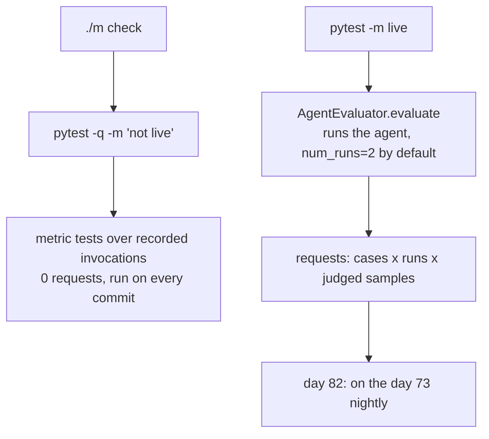

# 5.1 — Running them from pytest

## One-line answer

`AgentEvaluator.evaluate` makes an evalset callable from a normal test function, which is exactly what
Principle 11 wants — and the thing to notice before you use it is `num_runs: int = 2`, because a
default that runs the agent twice per case is a default that doubles the bill.

## The story

The seatbelt light in a car.

It is not a separate system you have to remember to consult. There is no seatbelt checklist taped to
the dashboard, no procedure, no separate device you switch on before setting off. The check has been
put **inside the thing you were going to do anyway**, so it happens whether or not anybody remembers
it.

Compare it with the fire extinguisher in the corridor of an office, which has a card on it and a date,
and which somebody is supposed to check once a year. It is a perfectly good extinguisher. What it does
not have is any way of inserting itself into anybody's day.

The seatbelt light gets checked ten times a day by people who are not thinking about seatbelts. The
extinguisher gets checked when a person with a clipboard walks past.

## The idea in plain language

Sutra already has a place where checks live: `tests/`, run by `uv run python -m pytest -q -m "not
live"`, wired into `./m check` since Day 0. Everything that gates a commit goes through it.

An eval suite that runs somewhere else is the extinguisher. It has to be remembered, so it will be
forgotten. The fix is to make the evalset something a test function calls, and ADK provides exactly
that entry point.

From `adk.dev/evaluate/`, the documented shape:

```python
from google.adk.evaluation.agent_evaluator import AgentEvaluator


@pytest.mark.asyncio
async def test_agent():
    await AgentEvaluator.evaluate(
        agent_module="agent_name",
        eval_dataset_file_path_or_dir="path/to/eval/file",
    )
```

**Line by line:**

- `@pytest.mark.asyncio` because the call is awaited — the marker comes from `pytest-asyncio`, which is
  a separate package and not one this repository has.
- `agent_module` is an **import path string**, not an agent object: the function imports it and runs it.
- `eval_dataset_file_path_or_dir` accepts a file or a directory, and a directory means every
  `.evalset.json` under it.
- Nothing is passed for the thresholds. They come from `test_config.json` beside the eval file — part
  [3.4](../03-two-metrics-that-cost-nothing/3.4-the-threshold-is-the-test.md).

Three things about it that decide how you use it.

**It is `async`.** The call is awaited, so the test needs an async runner. `pytest-asyncio` is the usual
one and it is **not** currently a dependency of this repository — a fact worth checking before writing
the test rather than after.

**It raises rather than returns.** `AgentEvaluator.evaluate` is annotated `-> None`. A failing suite is
an exception, which is exactly what `pytest` wants and exactly what makes it awkward to get the scores
out for a report. Part [1.1](../01-a-test-with-a-score/1.1-a-test-that-answers-how-much.md)'s argument
about keeping per-case scores runs into this: the pytest path gives you pass or fail, and the scores go
to stdout.

**It runs the agent.** This is the big one. Everything before this part in the day has compared
*recorded* invocations — no agent, no model, no requests. `AgentEvaluator.evaluate` takes an
`agent_module`, imports it, and runs it against every case. That is the whole value of it and it is
also the moment the suite stops being free.

Which brings the default that gives this part its one-line answer:

```text
num_runs: int = 2
```

The agent is run **twice per case** unless you say otherwise, because a real agent is
non-deterministic and one sample of a coin is not a measurement. It is a sensible default and it is a
factor of two on every cost calculation in part
[4.1](../04-what-it-costs-to-run/4.1-the-metrics-that-spend-nothing.md) — where it is already included,
as the `num_runs` term.

## Why Sutra needs it

Because Principle 11 is not "write evals", it is **evals are tests**, and something is only a test in
this repository if `./m check` runs it. Day 82 makes that formal — evals in CI, full runs on the Day
73 nightly — and this part is the mechanism it will use.

It also forces a decision this day cannot avoid. Sutra's test suite runs offline by default:
`pytest -q -m "not live"`, with `live` defined in `pyproject.toml` as *"hits a real API, model or
database — skipped by default, never run in CI"*. An eval that runs the agent hits a model. So the
eval test is a `live` test, and the day's actual assertions have to live somewhere that is not.

## The mechanism

The signature, read off the installed `google-adk==2.7.1` rather than from the docs page:

```text
AgentEvaluator.evaluate(
    agent_module: str,
    eval_dataset_file_path_or_dir: str,
    num_runs: int = 2,
    agent_name: Optional[str] = None,
    initial_session_file: Optional[str] = None,
    print_detailed_results: bool = True,
    artifact_service: Optional[BaseArtifactService] = None,
    output_file: Optional[str] = None,
    app_name: Optional[str] = None,
    eval_set_results_manager: Optional[EvalSetResultsManager] = None,
) -> None
```

**Line by line:**

- `agent_module: str` is an import path, not an agent object. The function imports it, which means the
  module has to be importable from wherever pytest runs — and that its import side effects happen
  during the test.
- `eval_dataset_file_path_or_dir` accepts a **directory**, in which case every `.evalset.json` under it
  is run. That is how a suite split by capability — part
  [2.1](../02-the-evalset-file/2.1-the-evalset-is-a-file.md)'s recommendation — gets run as one.
- `num_runs: int = 2` is the default this part is about. Set it to `1` and the suite is half the price
  and noticeably flakier; set it higher and borderline cases stabilise and the bill grows linearly.
- `print_detailed_results: bool = True` — on by default, printing per-case detail to stdout. Under
  `pytest -q` that output is captured and only shown on failure, which is usually what you want and is
  worth knowing when you wonder where the scores went.
- `output_file: Optional[str]` writes results to a file. This is the answer to "the pytest path gives
  you pass or fail" — pass a path and the per-case scores are on disk for a report.
- There is no `config_file_path` parameter. The thresholds come from `test_config.json` **beside the
  eval file**, resolved by `find_config_for_test_file` — part
  [3.4](../03-two-metrics-that-cost-nothing/3.4-the-threshold-is-the-test.md).

The test, written for Sutra's conventions:

```python
import pytest

from google.adk.evaluation.agent_evaluator import AgentEvaluator


@pytest.mark.live
@pytest.mark.asyncio
async def test_triage_desk_evalset() -> None:
    """The full evalset against the real desk. Costs requests; skipped by default."""
    await AgentEvaluator.evaluate(
        agent_module="sutra.desk",
        eval_dataset_file_path_or_dir="days/day-79-evals-are-tests/lab/triage.evalset.json",
        num_runs=1,
    )
```

**Line by line:**

- `@pytest.mark.live` first, because this test runs the agent and therefore spends quota. The marker is
  declared in `pyproject.toml` and `./m check` runs `-m "not live"`, so this test is **skipped by
  default** — which is the correct behaviour for something with a bill attached and the reason part
  [5.2](5.2-the-suite-that-only-goes-green.md) has to worry about a suite nobody runs.
- `@pytest.mark.asyncio` because the call is awaited. `pytest-asyncio` is not currently a dependency of
  this repository, so this test does not run until somebody adds it — which is a `TODO(me)` in the
  hub's build brief rather than something to install quietly here.
- `num_runs=1` overrides the default, deliberately and visibly. Two runs is the right default for a
  non-deterministic agent and the wrong one for a curriculum whose measured daily allowance is 20
  requests. Writing the override rather than accepting the default is what makes the cost decision
  reviewable.
- The evalset path points at the lab's generated file. In a real project it would live beside the tests;
  here it is generated by `cases.py`, and part
  [2.1](../02-the-evalset-file/2.1-the-evalset-is-a-file.md)'s check-yourself asks which of the two is
  the source of truth.

And the part that is **not** live — the assertions this day actually ships, over recorded invocations:

```python
def test_trajectory_metric_catches_an_extra_lookup() -> None:
    """The one_lookup case must fail when the desk reads the whole queue first."""
    evaluator = TrajectoryEvaluator(threshold=1.0)
    case = next(c for c in CASES if c.eval_id == "one_lookup")
    result = evaluator.evaluate_invocations(
        actual_invocations=[answer(case, buggy=True)],
        expected_invocations=[expected(case)],
    )
    assert result.overall_score == 0.0
```

**Line by line:**

- No `live` marker, because nothing here runs an agent or calls a model — it scores two recorded
  invocations, which is what the whole of sections 1 to 4 has been doing.
- It asserts that a **failure** is detected, not that the suite passes. That is part
  [2.3](../02-the-evalset-file/2.3-the-case-that-cannot-fail.md)'s discipline in test form: the useful
  assertion about an eval is that it can go red.
- `next(c for c in CASES if ...)` raises `StopIteration` if the case is renamed, which turns a silently
  vacuous test into a loud error. A `.get`-style lookup with a default would quietly test nothing.
- `assert result.overall_score == 0.0` rather than `< 1.0`, because part
  [3.1](../03-two-metrics-that-cost-nothing/3.1-tool-trajectory-avg-score.md) established this metric
  has no middle values. Asserting the exact value documents that fact.



## When it breaks

The first break is a missing runner, and it is the one everybody hits:

```text
PytestUnhandledCoroutineWarning: async def functions are not natively supported.
You need to install a suitable plugin for your async framework, for example:
  - anyio
  - pytest-asyncio
```

and — this is the part that matters — **pytest reports the test as passed or skipped rather than
failed**, depending on version and configuration. An async test with no async plugin does not run and
does not necessarily complain loudly. A whole eval suite can be "green" because none of it executed.

The second break is quieter and costs money. Accept `num_runs=2` on a sixty-case suite with one judged
metric and part [4.1](../04-what-it-costs-to-run/4.1-the-metrics-that-spend-nothing.md)'s arithmetic
gives 600 requests, against a measured daily allowance of 20 on the Flash lane. What arrives is Day
78's refusal, part-way through:

```text
429 RESOURCE_EXHAUSTED
generativelanguage.googleapis.com/generate_content_free_tier_requests
Please retry in ~53s
```

leaving a run where some cases have scores and some are `NOT_EVALUATED` — a real `EvalStatus` value on
2.7.1 — and a pytest failure whose message is about a quota rather than about the desk.

The smallest fix for the first is to add the plugin **and then deliberately break a test to check it
runs**. The smallest fix for the second is the `num_runs=1` override above, written explicitly, with
the reason next to it.

## In production

**What a professional writes instead of one test function.** Two suites with two cadences: the
deterministic metric tests over recorded invocations, run on every commit inside the normal test
command, and the live agent evaluation on a schedule. Both are `pytest`, which matters more than it
sounds — one runner, one output format, one place to look — but they are selected by marker and they
mean different things.

**What degrades at scale.** Eval tests are slow, and slow tests get moved out of the default run. Once
they are out of the default run they are out of the habit, and a suite outside the habit decays at the
speed of the codebase. The defence is the split above: keep the fast half in the default run
permanently, so the vocabulary and the fixtures stay alive even when the expensive half runs weekly.

**The failure that only shows with real traffic.** `num_runs=2` exists because agents are
non-deterministic, and with a real model a trajectory case can pass on run one and fail on run two.
`AgentEvaluator` handles that by running twice; what it cannot do is tell you whether a red result is a
regression or a coin landing badly. That is what makes eval flakiness different from test flakiness:
the flake is a property of the system, not of the harness.

**The review comment a senior engineer leaves:** *"Mark the live one and keep the recorded-invocation
tests unmarked, so `./m check` still exercises the metrics on every commit. Set `num_runs` explicitly
either way — I do not want the number of times we run the agent to be a library default nobody read.
And add `pytest-asyncio` properly with a pin and a ledger row; right now that async test would silently
not run."*

**The interview question:** *"How do you run LLM evaluations in CI?"* The answer that shows experience
splits by cost: the deterministic checks gate every commit, the model-backed ones run on a schedule,
and both use the project's normal test runner so there is one place to look. The tell is whether they
mention that the expensive half must not gate merges — because a gate people cannot afford to wait for
is a gate people learn to bypass.

## Check yourself

```bash
cd "C:/Users/nisha_gnzw/OneDrive/Desktop/Projects/sutra"
uv run python -c "
import inspect
from google.adk.evaluation.agent_evaluator import AgentEvaluator
print(inspect.signature(AgentEvaluator.evaluate))"
```

Read the printed signature and find the two parameters that change what a run costs. Say what each
would have to be set to for a sixty-case suite to fit inside twenty requests.

Then check whether this repository can run an async test at all:

```bash
uv run python -m pytest --version
uv run python -c "import pytest_asyncio" 2>&1 | tail -1
```

Say what the second command tells you, and what would happen to an `async def test_...` today.

**Out loud, without scrolling up:** which of this day's tests belong in `./m check` and which need the
`live` marker, and what is the rule that separates them?

**Next:** [5.2 — The suite that only goes green](5.2-the-suite-that-only-goes-green.md).
