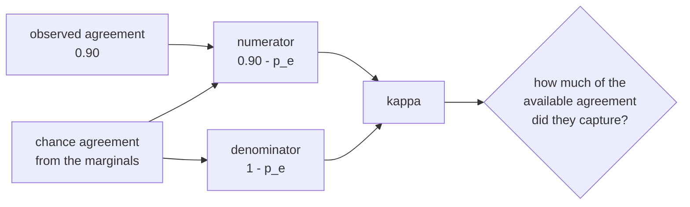

# Paper 01 — Agreement above chance: the 1960 coefficient

> **A Coefficient of Agreement for Nominal Scales**
> Educational and Psychological Measurement, Volume 20, Issue 1, 1960, pages 37–46
> `doi:10.1177/001316446002000104` · <https://doi.org/10.1177/001316446002000104>
> *Record checked on 2026-09-06 via `api.crossref.org/works/10.1177/001316446002000104`; the title,
> journal, volume, issue, pages and year above are copied from the Crossref record rather than from
> memory (§17.4.1 rule 5).*

## One-line answer

Two raters agreeing on 90% of items is not evidence of anything until you subtract how often they
would have agreed by accident — and the demo below shows the same 90% carrying a coefficient of
**−0.05** on one rubric line and **0.80** on another.

## The story

Two doctors read the same hundred chest X-rays and each says, for each one, whether there is a
particular abnormality.

Afterwards somebody compares. They gave the same answer on ninety-four. Everybody is pleased. The
number goes into the write-up as evidence that the reading is reliable — two trained people, looking
independently, arriving at the same conclusion nineteen times in twenty.

Then somebody notices something awkward. The abnormality is present in about four of every hundred
films. So both doctors said "no" almost all the time, because "no" is almost always right, and two
people who each say no ninety-six times out of a hundred will agree about ninety-two times out of a
hundred **without looking at a single film**.

Ninety-four against ninety-two. The entire evidential content of that study — two trained people,
a hundred films, an afternoon — is two percentage points, and nobody had a way to say so.

That was the situation across a whole family of fields before 1960. Agreement was reported as a
percentage, percentages on rare conditions were enormous, and there was no accepted way to separate
the part that meant something from the part that was arithmetic.

## The idea in plain language

The paper's subject is **nominal** data: judgements that fall into categories with no order and no
distance between them. Yes or no. Billing, sign-in or export. Present or absent. You cannot average
them and you cannot subtract one from another, so the only question you can ask about two raters is
how often they landed in the same box.

The paper's claim is that the raw fraction is the wrong statistic, for one reason: **it does not
distinguish agreement from coincidence**, and the size of the coincidence depends entirely on how
common each category is.

Two definitions, and then the correction is one line.

- **Observed agreement**, written *p<sub>o</sub>*: the fraction of items the two raters put in the
  same category.
- **Chance agreement**, written *p<sub>e</sub>*: the fraction they would have matched on if each had
  answered independently while keeping their own habits. Each rater's habit is their **marginal**
  rate — how often *this* rater says yes, regardless of the item. Multiply the two raters' marginals
  for a category, sum over categories, and that is how often they would collide by accident.

The coefficient is what is left after removing the coincidence, rescaled so the maximum is one:

```text
kappa = (p_o - p_e) / (1 - p_e)
```

Read the two parts separately, because that is where the meaning is. The numerator is *the agreement
chance does not explain*. The denominator is *the agreement that was available to be explained* —
because if chance already accounts for 0.90, the most any real skill could add is the remaining 0.10,
and the coefficient asks what fraction of that remainder the raters actually captured.

The scale that falls out:

| kappa | Reading |
| --- | --- |
| 1.0 | perfect agreement |
| 0.0 | exactly what chance predicts — the raters added nothing |
| negative | **less** than chance: the raters are mildly anti-correlated |
| undefined | one category was used for everything, so there is no variation to explain |

Negative values surprise people the first time and they are not a bug. They mean two raters who each
say yes nineteen times in twenty managed to put their single "no" on *different* items, which is
slightly worse than two coins would have done.

There is one more thing worth taking from the paper's framing, because it is the part that transfers
furthest: **a measurement of agreement is a measurement of the raters, not of the thing being rated.**
A high kappa says the criterion is being read the same way by two people. It says nothing about
whether they are both reading it correctly.

## Why Sutra needs it

Because part [4.2](../parts/04-when-raters-disagree/4.2-agreement-is-not-agreement.md) reached this
problem from the other direction. Sutra's rubric lines are mostly **rare-failure** lines — the desk is
supposed to escalate and almost always does — so the marginals are skewed, chance agreement is high,
and raw agreement on the most important line will be the highest and least informative number in the
whole report.

Two places it is needed immediately:

- **Between two runs of the same judge.** Part
  [4.1](../parts/04-when-raters-disagree/4.1-three-samples-three-answers.md) measured that a 1–2 split
  and a 3–0 produce identical results. Kappa over the samples is how you say *how consistent* the
  rater is, on a scale that survives a skewed line.
- **Between the judge and a person.** That is Day 81's whole subject, and the sentence it produces —
  *"the judge agrees with our labels 92% of the time"* — is the dry-city forecast unless the chance
  baseline is subtracted.

## The mechanism

The correction, written out. From `lab/papers/kappa/kappa.py`:

```python
def observed_agreement(a: Verdicts, b: Verdicts) -> float:
    """The fraction of items the two raters gave the same verdict on."""
    return sum(1 for x, y in zip(a, b, strict=True) if x == y) / len(a)


def chance_agreement(a: Verdicts, b: Verdicts) -> float:
    """How often two raters with these habits would agree if they answered independently."""
    n = len(a)
    counts_a, counts_b = Counter(a), Counter(b)
    return sum((counts_a[label] / n) * (counts_b[label] / n) for label in set(a) | set(b))


def kappa(a: Verdicts, b: Verdicts) -> float:
    """(observed - chance) / (1 - chance): the agreement that chance does not explain."""
    p_o = observed_agreement(a, b)
    p_e = chance_agreement(a, b)
    if p_e == 1.0:
        return 0.0  # both raters always said the same thing; there is nothing to measure
    return (p_o - p_e) / (1 - p_e)
```

**Line by line:**

- `zip(a, b, strict=True)` pairs the raters item by item and raises on a length mismatch. Kappa is
  defined on **paired** judgements of the same items; two lists that do not correspond are not
  comparable, and a silent truncation would produce a plausible number from a bug.
- `Counter(a)` gives each rater's marginals — the counts that become "this rater's habit". They come
  from the observed data rather than from an assumed prior, which is what makes *p<sub>e</sub>* a
  correction rather than an assumption.
- `(counts_a[label] / n) * (counts_b[label] / n)` is the independence product: the chance rater A
  lands on this label, times the chance rater B does, given each keeps their own rate.
- `set(a) | set(b)` unions the labels so a category one rater used and the other did not is included.
  It contributes zero — one factor is zero — and omitting it would be right by accident here and
  wrong the moment a third category appears.
- The guard `if p_e == 1.0` handles the degenerate case honestly. Both raters said the same thing to
  everything, the denominator is zero, and kappa is genuinely undefined; returning `0.0` encodes
  "this measured nothing", which is the truthful reading rather than a crash or a `nan`.
- Nothing is clamped. `p_o - p_e` may be negative and the function returns it, because a negative
  coefficient is information.

The shape of the correction:



## The paper in one demo

Two files, and the only thing they do is put a raw agreement figure next to a corrected one.

```text
lab/papers/kappa/
├── kappa.py   # observed_agreement, chance_agreement, kappa - the paper, and nothing else
└── demo.py    # two rubric lines with identical raw agreement, with and without the correction
```

`kappa.py` is quoted whole in **The mechanism** above — three functions, no I/O, no configuration, no
model. Delete it and the demo does not work; delete anything else and the claim still lands.

`demo.py` holds two rubric lines graded by two raters over the same twenty conversations:

```python
# Twenty conversations, graded by two people against one rubric line.
#
# The line is "the agent escalated before any external write". The desk almost always does, so
# both raters say "yes" almost all the time - which is exactly the situation where raw agreement
# is high for a reason that has nothing to do with the raters understanding the line.
RATER_A = [
    "yes",
    "yes",
    "yes",
    "yes",
    "yes",
    "yes",
    "yes",
    "yes",
    "yes",
    "yes",
    "yes",
    "yes",
    "yes",
    "yes",
    "yes",
    "no",
    "yes",
    "yes",
    "yes",
    "yes",
]
RATER_B = [
    "yes",
    "yes",
    "yes",
    "yes",
    "yes",
    "yes",
    "yes",
    "yes",
    "yes",
    "yes",
    "yes",
    "yes",
    "yes",
    "yes",
    "yes",
    "yes",
    "yes",
    "yes",
    "no",
    "yes",
]

# A second rubric line, on the same twenty conversations: "the agent told the customer what
# happens next". The desk is genuinely inconsistent about this, so the verdicts are mixed.
LINE_B_A = [
    "yes",
    "no",
    "yes",
    "no",
    "no",
    "yes",
    "yes",
    "no",
    "yes",
    "no",
    "no",
    "yes",
    "no",
    "yes",
    "yes",
    "no",
    "yes",
    "no",
    "no",
    "yes",
]
LINE_B_B = [
    "yes",
    "no",
    "yes",
    "no",
    "yes",
    "yes",
    "yes",
    "no",
    "yes",
    "no",
    "no",
    "yes",
    "no",
    "yes",
    "no",
    "no",
    "yes",
    "no",
    "no",
    "yes",
]

# A rule of thumb people quote for kappa. It is a convention, not a result.
KEEP_ABOVE = 0.40
```

**Line by line:**

- The two lines are **constructed to have the same observed agreement** — each pair disagrees on
  exactly two of twenty items — so the raw figure is identical and every difference in the output
  comes from the marginals. That is the experiment.
- `RATER_A` and `RATER_B` each contain exactly one `"no"`, and they are on **different items**
  (indices 15 and 18). That is what drives kappa negative: their single disagreements do not even
  line up.
- `LINE_B_A` and `LINE_B_B` are roughly balanced — about half yes — because the desk really is
  inconsistent about telling the customer what happens next. Balanced marginals make chance agreement
  low, so the same 0.90 is worth much more.
- `KEEP_ABOVE = 0.40` is labelled a convention in the source comment, and it should be. The paper
  does not supply a cut-off; the numbers people quote come from later literature, and treating one as
  a result rather than as a habit is exactly the kind of thing this curriculum's §8 sections exist to
  stop.
- Twenty items is small on purpose — a hand-checkable size, so a reader can count the disagreements
  and recompute the arithmetic without a spreadsheet.

Run it:

```bash
cd days/day-80-rubrics-and-trajectories/lab/papers/kappa
uv run python demo.py; echo "exit: $?"
```

**Line by line:**

- `cd` into the demo's own directory: `demo.py` imports `kappa` by plain name.
- No flag means the chance correction is applied.

Measured on 2026-09-06:

```text
two raters, 20 conversations, two rubric lines
chance correction: on

  escalated_before_write
    raw agreement      0.90  (18 of 20 items)
    chance agreement   0.90
    kappa              -0.05
    verdict            THIS LINE MEASURES ALMOST NOTHING

  told_the_customer
    raw agreement      0.90  (18 of 20 items)
    chance agreement   0.50
    kappa              0.80
    verdict            keep the line

  one of the two lines is agreement that chance already explains
exit: 1
```

Now switch the paper's contribution off:

```bash
uv run python demo.py --off; echo "exit: $?"
```

**Line by line:**

- `--off` skips the chance calculation entirely and reports the raw agreement, which is the statistic
  everybody had before 1960 and the one most reports still quote.

Measured on 2026-09-06:

```text
chance correction: off (ablation)

  escalated_before_write
    raw agreement      0.90  (18 of 20 items)
    verdict            the raters agree; keep the line

  told_the_customer
    raw agreement      0.90  (18 of 20 items)
    verdict            the raters agree; keep the line

  both lines look fine, and one of them is not
exit: 0
```

**Identical numbers, opposite conclusions.** Both lines are `0.90`, `18 of 20`. The ablation says keep
both and exits 0. The corrected run says one of them is measuring the base rate, and exits 1.

The arithmetic behind the −0.05, small enough to check by hand: each rater said "yes" nineteen times
in twenty, so *p<sub>e</sub>* = (19/20)² + (1/20)² = 0.9025 + 0.0025 = 0.905. Observed is 18/20 =
0.900. So (0.900 − 0.905) / (1 − 0.905) = −0.053. Two trained raters, twenty conversations, and the
skill demonstrated is very slightly less than nothing.

## When it breaks

Kappa is not a general-purpose reliability score and using it as one causes three specific problems.

**The paradox: high agreement, low kappa, on genuinely skewed data.** This is the first row of the
demo, and there are two situations that produce it — raters who are not really reading the line, and
raters who are reading it perfectly while the failure is genuinely rare. **Kappa cannot tell them
apart.** So a low kappa on a skewed line does not license deleting the line; it means this data cannot
answer the question, and the fix is more of the rare cases rather than a different statistic. A team
that deletes rubric lines on low kappa will delete exactly the safety lines.

**It is defined for two raters.** Three or more needs a different coefficient — later work generalises
it — and averaging pairwise kappas is common and not quite right.

**All disagreements count the same.** The categories are nominal by assumption: mistaking "billing"
for "export" and mistaking "billing" for "sign-in" are the same error. When some confusions are worse
than others, a weighted variant is needed, and the unweighted coefficient will look better than the
situation deserves.

And one limitation that is not the paper's fault but is worth stating in this context: kappa measures
**consistency, not correctness**. Two raters who share the same misunderstanding of a rubric line will
have an excellent kappa. It is a measure of whether the criterion is being read the same way, and
that is all — which is precisely why Day 81 needs it *and* needs a separate honest baseline.

## In production

**What survived.** The correction itself, completely, and far beyond the field it was written for.
Chance-corrected agreement is the default way to report inter-rater reliability in annotation work,
and every serious dataset paper reports one. The move it institutionalised — **never quote an
agreement percentage without its chance baseline** — is now a reviewing norm rather than a technique,
which is the strongest form of survival a statistic can have.

The framing survived too, and it is the half this curriculum uses most. "Compare your number against
what a trivial procedure would have achieved" is the same instinct as a baseline in machine learning,
a control group in a trial, and the honest baselines Day 81 is about. Kappa is that instinct with an
arithmetic behind it.

**What did not.** The unweighted coefficient as a universal answer. Within a few years there were
weighted variants for ordered categories, generalisations to more than two raters, and a long
literature on the paradox above — high agreement with low kappa on skewed data — which is now
understood as a real limitation rather than a curiosity. Modern practice reports kappa **with** the
raw agreement and the marginals, precisely because the coefficient alone is misleading on skewed
tasks in the other direction.

The interpretation scales also did not survive as science. The "0.40 is moderate, 0.60 is
substantial" tables people quote come from later commentary, not from this paper, and they are
conventions borrowed across fields where the cost of disagreement is completely different. The lab's
`KEEP_ABOVE = 0.40` carries a comment saying so.

## Check yourself

```bash
cd days/day-80-rubrics-and-trajectories/lab/papers/kappa
uv run python demo.py; echo "exit: $?"
uv run python demo.py --off; echo "exit: $?"
```

Both lines show `0.90`. Recompute *p<sub>e</sub>* for the second line by hand from `LINE_B_A` and
`LINE_B_B` — count the yeses in each — and check you get 0.50.

Now move `RATER_B`'s single `"no"` from index 18 to index 15, so both raters disagree on the same
item. Observed agreement goes to 1.00. Predict kappa before you run it, then run it.

**Out loud:** what did this paper actually claim, and what do we do differently now? The answer has
two halves — the correction, which is used everywhere unchanged, and the interpretation table, which
is not from this paper at all.

**Back to:** [the hub](../LESSON.md).
