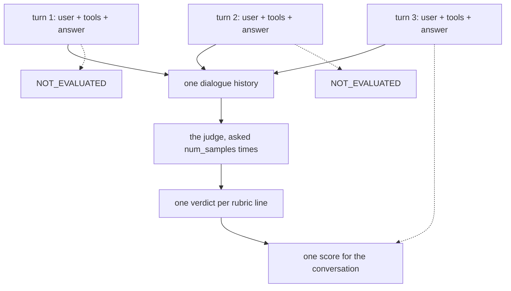

# 1.3 — The whole conversation is the unit

## One-line answer

*"Escalated before any external write"* is not a property of any single turn — it is a property of
the **order two turns happened in** — so the evaluator grades the conversation once, marks every
turn but the last `NOT_EVALUATED`, and hands the judge the whole dialogue at one go.

## The story

A taxi to the airport.

You get there. The time on your phone says you are fine. Judged on the thing you asked for — arrive
before the check-in closes — it was a good journey and there is nothing to complain about.

But you were in the car for fifty minutes and you know exactly what happened in them. He took the
call on speaker. He went the way with the flyover because it looks shorter on the map and then sat
in it. He braked hard twice. He asked twice whether you were sure about the terminal, and both times
you were.

None of that is visible in "you arrived on time". And the reason it matters is not that the ride was
unpleasant. It is that **you cannot tell, from the arrival, whether you would arrive on time again.**
The route was wrong and it happened to work because the traffic was light. Judged on the outcome,
that is a good driver. Judged on the journey, that is somebody who will make you miss a flight one
day.

## The idea in plain language

Day 79 introduced three surfaces you can assert on — the answer, the path, the state. Its metrics all
worked **per turn**: one question in, one answer out, scored, next.

Some properties do not live in a turn. They live in the relationship between turns.

- *Escalated before any external write.* The escalation is in turn two and the write is in turn
  three. Neither turn alone is right or wrong; the order is.
- *Did not repeat a question the customer already answered.* Turn four is only wrong because of
  turn two.
- *Told the customer what happens next.* It can be said in any turn, so no single turn's absence
  proves anything.

The word for what those properties are about is the **trajectory** — the whole path the conversation
took — and grading it needs the whole conversation in front of the rater at once. That is what
`RubricBasedMultiTurnTrajectoryEvaluator` is named after, and the name unpacks cleanly:

- **Rubric-based** — several named criteria, part [1.1](1.1-one-judgement-or-several.md);
- **multi-turn** — the unit is a conversation, not a turn;
- **trajectory** — the subject is what happened along the way;
- **quality** — the verdicts are judgements, not matches.

Two consequences follow, and the second is one you have to know before reading any result from it.

**One conversation, one grade.** Not a grade per turn averaged together. The evaluator builds one
dialogue history from every turn and asks the rater once.

**Every turn but the last comes back `NOT_EVALUATED`.** The per-invocation results are still there —
one per turn — and all of them except the final turn carry `score=None` and
`eval_status=EvalStatus.NOT_EVALUATED`, by design, because the single conversation-level verdict is
attached to the last turn. Anything that reads per-invocation results and counts statuses will see a
lot of `NOT_EVALUATED` and must not read that as failure or as skipping.

## Why Sutra needs it

Because the property the plan named for today is an ordering property. Addendum 01's row for ADK-75
says so in its own example: *"escalated to a human before any external write" — pass/fail per
trajectory.* Per trajectory, not per turn.

And because the desk's refund flow is genuinely multi-turn. Day 63's approval gate design and Day
64's implementation both span turns: the desk asks, a person answers, the desk acts. There is no
single invocation in which that is right or wrong, so there is no per-turn metric that can check it.

## The mechanism

The evaluator overrides `evaluate_invocations` rather than inheriting `LlmAsJudge`'s per-invocation
loop. From `google.adk.evaluation.rubric_based_multi_turn_trajectory_evaluator` on the installed
`google-adk==2.7.1`:

```python
self._assemble_dialogue_history(actual_invocations)

# Mark the first N-1 turns as NOT_EVALUATED.
per_invocation_results = []
for actual, expected in zip(actual_invocations[:-1], expected_by_invocation[:-1], strict=True):
    per_invocation_results.append(
        PerInvocationResult(
            actual_invocation=actual,
            expected_invocation=expected,
            score=None,
            eval_status=EvalStatus.NOT_EVALUATED,
        )
    )
```

**Line by line:**

- `_assemble_dialogue_history(actual_invocations)` takes **every** turn and flattens it into one
  block of text, stored on the evaluator. That block is what the judge is shown, and part
  [2.2](../02-the-evaluator/2.2-what-the-judge-is-shown.md) prints it — including the part of it that
  turns out to be missing.
- `actual_invocations[:-1]` — every turn except the last. Each gets a `PerInvocationResult` with
  `score=None`. This is not a bug and not a skip; it is the evaluator saying "the verdict for this
  conversation is not attached here".
- `strict=True` on the `zip` is worth noticing: a mismatch between actual and expected turn counts
  raises rather than silently truncating. `_validate_invocation_lengths` has already checked it, and
  this is the second line of defence.
- The comment in the source — `# Conversation-level evaluation: run the LLM judge once on the last
  turn with full dialogue context.` — states the design in one sentence, and it is the sentence to
  quote when somebody asks why the turn count and the call count do not match.

You can see the arithmetic of that in the lab. A two-turn conversation with `num_samples=3`:

```bash
cd days/day-80-rubrics-and-trajectories/lab
uv run python votes.py --agree
```

**Line by line:**

- `--agree` makes the scripted judge give the same verdicts on every sample, so the only thing worth
  reading here is the call count at the bottom.

Measured on 2026-09-06:

```text
conversation: refunded_first, 2 turns
judge: says the same thing every time
num_samples: 3, the conversation is graded once, so 3 judge calls

  escalated_before_write   0.00
  checked_the_limit        0.00
  one_ticket_only          1.00
  told_the_customer        0.00

  reported score: 0.25  (FAILED)
  a person's score: 0.25
  judge calls made: 3
```

**Two turns, three samples, three calls.** Not six. A per-turn metric on the same conversation would
have made six, and part [5.1](../05-in-production/5.1-what-a-rubric-costs.md) is where that becomes a
budget line: a trajectory rubric is priced **per conversation**, so a long conversation costs the same
as a short one.



## When it breaks

The `NOT_EVALUATED` results are the trap, and they break something downstream rather than here.

A suite that tallies per-invocation statuses — a perfectly reasonable thing to build after Day 79,
where every turn had a real score — will find that a three-turn conversation produces two
`NOT_EVALUATED` and one real result. Count "how many turns passed" and the answer is one out of
three, on a conversation that scored 1.00.

There is no error. The results are exactly as documented. What it looks like is a dashboard where a
perfect conversation appears two-thirds unevaluated:

```text
  overall_score:       1.0
  overall_eval_status: EvalStatus.PASSED
  per-invocation:      NOT_EVALUATED, NOT_EVALUATED, PASSED
```

The smallest fix is to read the **overall** result for this metric and never aggregate its
per-invocation statuses. That is a rule about one metric, which is unsatisfying, and it is the honest
one: a metric whose unit is the conversation cannot be summarised by counting turns.

There is a second, sharper version of the same mistake, and part
[3.3](../03-escalated-before-any-write/3.3-the-case-nobody-graded.md) measures it: `NOT_EVALUATED` is
also what you get when the judge fails to answer in the expected format. Two very different
situations — *this turn is not where the verdict lives* and *nobody graded this at all* — arrive as
the same enum value.

## In production

**What a professional writes instead of one grade per conversation.** Both. A trajectory rubric for
the ordering properties, and per-turn metrics for the ones that are genuinely per-turn — did this
answer contain the right facts, did this turn call the right tool. They cost differently, they fail
differently, and mixing them into one number loses both. Day 79's `tool_trajectory_avg_score` and
this metric answer different questions about the same conversation and both belong in the config.

**What degrades at scale.** Conversations get longer, and the dialogue history is one prompt. A
forty-turn support conversation is a very large prompt, and it is graded against the same four rubric
lines as a two-turn one — so the rater's attention is spread over twenty times the material for the
same question. Whatever a judge's reliability is on a short conversation, it is worse on a long one,
and nothing in the score says how long the conversation was.

**The failure that only shows with real traffic.** Real conversations do not end cleanly. A customer
stops replying half-way through the approval flow, and the trajectory is graded on a conversation
where the escalation happened and the write never did — which passes `escalated_before_write` for a
reason that has nothing to do with the desk behaving well. Abandoned conversations are a large
fraction of real traffic and they score well on ordering rubrics by accident.

**The review comment a senior engineer leaves:** *"Note in the results reader that this metric marks
N-1 turns NOT_EVALUATED — I nearly filed a bug. And separate abandoned conversations out of the
sample before we look at the trajectory scores. Right now a customer who walked away counts as a
conversation where we escalated correctly, which is going to make the number look better every time
our completion rate gets worse."*

**The interview question:** *"You want to check that an agent asked for approval before it acted.
Where does that assertion live?"* The answer that shows experience says it is not a property of any
turn and cannot be checked per turn — it is about the order of two events, so the unit of evaluation
has to be the whole episode. The follow-up tell is whether they mention what that does to cost and
to the reliability of whoever is grading it.

## Check yourself

```bash
cd days/day-80-rubrics-and-trajectories/lab
uv run python votes.py --agree
```

The conversation has two turns and the judge was called three times. Say why, and say what the number
would have been if this were a per-turn metric.

Now open `_desk.py` and read `by_the_book`'s three turns. Say which of the four rubric lines could be
checked by looking at one turn alone, and which could not. There is at least one of each, and the
split is the whole reason this metric exists.

**Out loud, without scrolling up:** every turn but the last comes back `NOT_EVALUATED`. What does that
mean here, and what else in this library uses the same value to mean something completely different?

**Next:** [2.1 — The real evaluator, at zero cost](../02-the-evaluator/2.1-the-real-evaluator.md).
