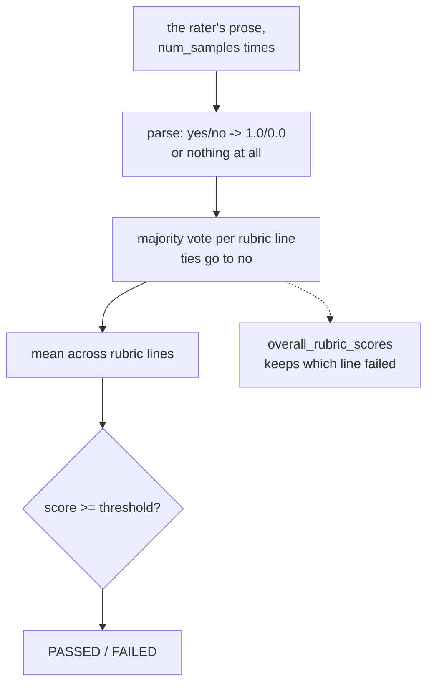

# 2.3 — Four verdicts, one number

## One-line answer

Between the rater's sentences and the `PASSED` in your results there are four separate steps — parse,
vote across samples, average across rubric lines, compare to a threshold — and every one of them is
a place where a real disagreement becomes a clean number with no trace of the disagreement left in
it.

## The story

The housing society election, and the evening they count.

There is one ballot box and three posts. Somebody empties the box onto a table and the counting
starts, and it is a sequence of separate operations that nobody thinks of as separate until one of
them goes wrong.

First: is this a valid ballot? Two are set aside — one has both boxes ticked, one has a name written
in the margin. Nobody argues; they are simply not countable.

Then: who won each post. Secretary is 31 to 24. Treasurer is 28 to 27. Committee member is 30 to 25.

Then: the announcement. *"The new committee is elected."*

By the time it reaches the notice board, the treasurer's one-vote margin and the secretary's seven
look identical. Both are "elected". The information that one of them is a coin-flip and the other is
not was real, was on the table an hour ago, and is not in the sentence anybody will read tomorrow.

Nothing dishonest happened. Every step was correct. It is just that each step throws something away,
and by the end there is one word left.

## The idea in plain language

A rubric score arrives through four transformations, in this order.

**1. Parse.** The rater replied with text. `DefaultAutoRaterResponseParser` pulls out one
`RubricResponse` per block — id, property, rationale, verdict — and maps `yes` to `1.0`, `no` to
`0.0`, anything else to `None`. If the counts of properties, rationales and verdicts do not all
match, it returns **nothing at all** rather than a partial list. Part
[3.3](../03-escalated-before-any-write/3.3-the-case-nobody-graded.md) is about what that costs.

**2. Vote across samples.** The judge was asked `num_samples` times. Each answer is a full set of
verdicts, so the aggregator has several opinions per rubric line and reduces them to one.
`MajorityVotePerInvocationResultsAggregator` is the default. Three samples saying yes, no, no gives
no — and the two-to-one is gone.

**3. Average across rubric lines.** Four lines, four verdicts, one mean. Three yeses and a no is
0.75. Which line was the no is preserved separately in `overall_rubric_scores`, and is **not** in the
number.

**4. Compare to a threshold.** `0.75 >= 1.0` is false, so `EvalStatus.FAILED`. One bit, from four
verdicts, from up to twenty rater answers.

The thing worth internalising is what each step is allowed to throw away, because the answer is
"quite a lot, deliberately, and for good reasons":

| Step | Turns | Into | And loses |
| --- | --- | --- | --- |
| parse | prose | `RubricResponse` per line | the rationale, unless you read it |
| vote | N samples per line | one verdict per line | how close the vote was |
| average | verdicts per line | one score | which line failed |
| threshold | a score | pass or fail | how far from the line it was |

Every row of that table is a place where a report can put the information back. `overall_rubric_scores`
restores row three. Nothing in ADK's result restores row two, and part
[4.1](../04-when-raters-disagree/4.1-three-samples-three-answers.md) measures what that hides.

## Why Sutra needs it

Because Sutra is about to have a number that a nightly job reports and a person reads over tea. Day
73's digest and Day 77's standup are both one-sentence summaries of a machine's night, and both days
found the same thing: the failure mode of a summary is not being wrong, it is being reassuring.

`refunded_first  0.25  FAILED` is a good line. `three of four rubric checks failed` is a worse one.
`the eval suite is 67% green` is a sentence with almost nothing in it. Knowing which step in the chain
each of those sits at is what lets you choose where to report from.

## The mechanism

Step one, from `google.adk.evaluation.rubric_based_evaluator` on the installed `google-adk==2.7.1`:

```python
for verdict in re.findall(_VERDICT_PATTERN, auto_rater_response):
    if "yes" in verdict.lower():
        score = 1.0
    elif "no" in verdict.lower():
        score = 0.0
    else:
        score = None

    scores.append(score)

# A partial parse can silently omit a failed rubric and inflate the score.
if not len(property_matches) == len(rationales) == len(scores):
    return []
```

**Line by line:**

- `"yes" in verdict.lower()` is a substring test, not equality, so `Verdict: yes, clearly` parses and
  so does `Verdict: yes.` — which is forgiving in the right direction for a rater that adds words.
- The `yes` branch is checked **first**, and that matters more than it looks: the string `"no"` is a
  substring of nothing here, but a verdict like `"yes, but not fully"` contains both. First-match
  wins, and it wins for yes.
- `score = None` for anything else. A verdict the parser cannot read is not a zero — it is an absence,
  which is the honest encoding and which flows through to `EvalStatus.NOT_EVALUATED`.
- The comment on the length check is the library explaining its own design, and it is worth quoting to
  anybody who thinks a lenient parser is friendlier: *"A partial parse can silently omit a failed
  rubric and inflate the score."* Returning `[]` on a mismatch is a deliberate refusal.

Steps two and three are two small default objects, named in `RubricBasedEvaluator.__init__`:

```text
      auto_rater_response_parser: AutoRaterResponseParser = (
          DefaultAutoRaterResponseParser()
      ),
      per_invocation_results_aggregator: PerInvocationResultsAggregator = (
          MajorityVotePerInvocationResultsAggregator()
      ),
      invocation_results_summarizer: InvocationResultsSummarizer = (
          MeanInvocationResultsSummarizer()
      ),
```

**Line by line:**

- Three strategy objects, each with a default, each replaceable. That is the extension point: a suite
  that wants "any line failing fails the case" swaps the summariser rather than post-processing the
  score, which is part [3.1](../03-escalated-before-any-write/3.1-a-safety-rule-as-a-rubric-line.md)'s
  request.
- The aggregator is **majority vote**, and its docstring on the sibling `FinalResponseMatchV2Evaluator`
  spells out the tie rule: *"In the case of a tie, consider the result to be invalid."* Two-two goes to
  no. That is a safety-favouring default and it is worth knowing it is a default rather than a law.
- The summariser is **mean**, which is why 0.25 and 0.50 came out of part
  [1.1](../01-a-rubric-is-a-decomposition/1.1-one-judgement-or-several.md)'s run and why every rubric
  line is worth exactly the same fraction of the score.
- These are **mutable default arguments** — one shared instance per class, created at import. They are
  stateless, so it is safe; it is also the kind of thing to check before writing a stateful
  replacement.

And step four is the threshold from Day 79 part 3.4, applied to the mean.



See the whole chain in one run:

```bash
cd days/day-80-rubrics-and-trajectories/lab
uv run python parse.py
```

**Line by line:**

- No flag runs `DefaultAutoRaterResponseParser` directly on a well-formed rater answer, so you see
  step one's output before any aggregation touches it.

Measured on 2026-09-06:

```text
rubric lines sent to the judge: 4
blocks the parser recovered:    4

  escalated_before_write  0.0
  checked_the_limit       1.0
  one_ticket_only         1.0
  told_the_customer       1.0

  average over what was recovered: 0.75
  the truth over all four lines:   0.75

  every line was recovered
exit: 0
```

Four `RubricResponse` objects with their ids attached, then one mean. That `0.75` is what a report
prints, and the four lines above it are what a person needs.

## When it breaks

The chain breaks at step one, and it breaks **safely**, which is the interesting part. Drop one
`Verdict:` line from an otherwise perfect answer:

```bash
uv run python parse.py --drop; echo "exit: $?"
```

**Line by line:**

- `--drop` replaces the single failing `Verdict: no` line with a sentence, simulating a rater that
  wandered off format on exactly the property it was unhappy about. Three properties still have
  verdicts.

Measured on 2026-09-06:

```text
rubric lines sent to the judge: 4
blocks the parser recovered:    0

  the parser returned nothing at all

  average over what was recovered: None
  the truth over all four lines:   0.75

  refusing to score beats scoring three lines out of four
exit: 0
```

**Zero blocks recovered, not three.** A lenient parser would have returned the three lines that
survived, all of them yeses, and the mean over them would be **1.00** — a perfect score on the
conversation whose one failing line is the one the rater could not phrase.

That is the failure the library's own comment names, and refusing to score is the right answer to it.
Nothing here is broken.

What *is* still open is what happens next, because "no score" has to be handled by whatever reads the
result. Part [3.3](../03-escalated-before-any-write/3.3-the-case-nobody-graded.md) runs that end to
end and finds a case with `overall_score: None` and `EvalStatus.NOT_EVALUATED`, which is not a pass and
is not a fail and will be counted as neither.

## In production

**What a professional writes instead of one score per case.** A results row that carries all four
levels: the per-rubric verdicts, the vote margin if the harness can get at it, the mean, and the
status. Storage is cheap and the row is written once; the analysis you will want in three months is
always one level lower than the one you kept.

**What degrades at scale.** The mean gets less sensitive as the rubric grows. With four lines one
failure moves the score by 0.25 and any threshold notices. With twenty lines one failure moves it by
0.05, which is inside the noise a real rater produces between samples — so the metric stops being
able to see a single regression at exactly the point the rubric gets comprehensive enough to
describe the system.

**The failure that only shows with real traffic.** Rater format compliance is not constant. A model
that returns well-formed blocks on short conversations starts wandering on long ones, so the
`NOT_EVALUATED` rate rises with conversation length — and long conversations are the complicated ones.
The cases that silently drop out of your suite are systematically the hard ones.

**The review comment a senior engineer leaves:** *"Log the parse failures with a rate, not just a
warning per occurrence. If five per cent of our cases come back NOT_EVALUATED I want that on the
dashboard next to the score, because a suite where one in twenty cases is unscored has a score that
means something different from what everyone thinks it means."*

**The interview question:** *"Walk me from your LLM judge's raw output to the pass or fail in your
report."* The answer that shows experience names each transformation and what it discards — and can
say which one they would report from if they could only keep one, which is almost always the
per-criterion verdicts rather than the score.

## Check yourself

```bash
cd days/day-80-rubrics-and-trajectories/lab
uv run python parse.py
uv run python parse.py --drop; echo "exit: $?"
```

The `--drop` arm recovers zero blocks and exits 0. Say why exiting 0 is right there, and what would
have to be true downstream for that to become a problem.

Now work out on paper: four rubric lines, `num_samples=5`, and the rater says `no` on
`escalated_before_write` in three of the five samples and `yes` in two, while agreeing on everything
else. What is the reported score, and what number would tell you the vote was 3–2? The second question
has an uncomfortable answer.

**Out loud, without scrolling up:** name the four steps between the rater's prose and `FAILED`, and
say what each one throws away.

**Next:** [3.1 — A safety rule as a rubric line](../03-escalated-before-any-write/3.1-a-safety-rule-as-a-rubric-line.md).
