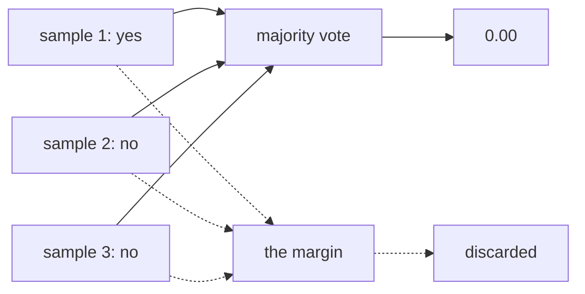

# 4.1 — Three samples, three answers

## One-line answer

`num_samples` exists because a rater asked the same question twice gives two answers, and the
majority vote that resolves that disagreement is invisible in the result — a 2–1 split and a
unanimous 3–0 both arrive as the same clean `0.00`.

## The story

Three people at a bus stop are asked how old the man across the road is.

The first says about fifty. The second says forty. The third says fifty-five.

Somebody writes down fifty.

That is a reasonable thing to write. It is roughly the middle, two of the three are near it, and if
you had to bet, fifty. What is not written down is that one person said forty, which means the range
of honest opinion was fifteen years wide on a man standing in plain sight in good light.

And here is the thing the number cannot carry: *fifty* looks exactly the same on the paper whether
the three said fifty, fifty and fifty, or forty, fifty and fifty-five. The confidence is not in the
number. It was in the room, and it stayed there.

## The idea in plain language

Day 79 part 4.1 introduced `num_samples` as a multiplier on cost — `cases × samples × runs` — and
quoted the field's own justification from `google-adk==2.7.1`:

> *"models tend to have certain degree of unreliability to them, we repeatedly sample them with the
> same data. These repeated invocation are them aggregated using some strategy. From
> experimentation, we have found 5 to be a good default."*

That sentence is the whole rationale. A judge is not a function. Ask it the same question five times
and you may get five identical answers, or four and one, or three and two. Sampling several times and
aggregating is how you get a stable number out of an unstable rater — and it works, in the sense that
the aggregated answer is more reliable than any single one.

What it does **not** do is tell you which case was close. Two things get flattened:

- **A 3–0 and a 2–1 both become one verdict.** The aggregator returns a result, not a margin.
- **Across rubric lines, a wobbly line and a certain one both contribute the same 0 or 1** to the
  mean.

So a case can be reported as `0.25 FAILED` on the strength of a rater that changed its mind on the
line that decided it, and the result carries no trace of that. There is no field for it: on 2.7.1
`EvaluationResult.model_fields` is `overall_score`, `overall_eval_status`, `per_invocation_results`
and `overall_rubric_scores`, and none of them is a margin.

Three consequences worth holding:

**More samples is more stable and not more informative.** Going from 3 to 9 makes the majority more
reliable and still reports one bit per line. The uncertainty is reduced, not measured.

**The tie rule is a policy.** With an even `num_samples` a split can be exactly half. `FinalResponseMatchV2Evaluator`'s
docstring states its rule outright — *"In the case of a tie, consider the result to be invalid"* — so
2–2 goes to fail. That is a safety-favouring default and it is a default, not a law.

**Samples cost linearly and the information gain does not.** This is the term Day 79 part 4.2 warned
against tuning downwards, and the reason is here: cutting `num_samples` to 1 does not make the metric
cheaper-but-similar, it makes it a single draw from a distribution nobody has looked at.

## Why Sutra needs it

Because the number this suite reports is going to be compared against yesterday's number, every night,
by Day 82's regression discipline. A case that flips between 0.25 and 0.50 because the rater is
genuinely uncertain about one line will look, in that comparison, exactly like a regression.

Knowing which of your cases sit on a knife edge is the difference between investigating a real change
and investigating a coin. Nothing in ADK's result tells you, so it has to be measured — which is what
this part does and what part [4.2](4.2-agreement-is-not-agreement.md) turns into a number you can act
on.

## The mechanism

The lab scripts a rater that changes its mind on exactly one line. From `lab/votes.py`:

```python
def wobbling(call: int) -> dict[str, str]:
    """The judge says yes on the first sample and no on the rest, for one rubric line."""
    verdicts = dict(HUMAN[WHICH])
    if call % SAMPLES == 0:
        verdicts[WOBBLY] = "yes"
    return verdicts
```

**Line by line:**

- `dict(HUMAN[WHICH])` starts from the human's verdicts — a fresh copy each call, because mutating
  the shared reference would make the script's second sample depend on its first.
- `call % SAMPLES == 0` flips the verdict on the **first** sample of each group of three. The rater is
  therefore 1–2 against itself on `escalated_before_write` and unanimous on the other three lines,
  which is what makes the run readable: one column is uncertain and the rest are not.
- `WOBBLY = "escalated_before_write"` — the wobble is deliberately put on the safety line, because
  that is the one where a coin-flip matters, and part
  [3.1](../03-escalated-before-any-write/3.1-a-safety-rule-as-a-rubric-line.md) is why.
- The function takes the call number and returns verdicts, so `_judge.py` can drive it per sample.
  A script that returned a constant could not express disagreement at all, which is why `_judge.script`
  takes a callable rather than a dict.

And the aggregator that resolves it, named as a default in `RubricBasedEvaluator.__init__` on 2.7.1:

```text
      per_invocation_results_aggregator: PerInvocationResultsAggregator = (
          MajorityVotePerInvocationResultsAggregator()
      ),
```

**Line by line:**

- It is a **strategy object with a default**, so a suite that wants unanimity — every sample must
  agree or the line is unresolved — swaps this rather than post-processing. That is the extension
  point for anybody who wants the margin to matter.
- It aggregates **per invocation**, before the mean across rubric lines. So the order is: vote within
  a line, then average across lines. Reversing those would give a different number and a different
  meaning.
- Nothing it returns carries the count. The aggregated result is a `PerInvocationResult` with a score,
  and the samples it was chosen from are not attached to it.

Run the wobbling rater:

```bash
cd days/day-80-rubrics-and-trajectories/lab
uv run python votes.py; echo "exit: $?"
```

**Line by line:**

- No flag: three samples, and the rater disagrees with itself on one line.

Measured on 2026-09-06:

```text
conversation: refunded_first, 2 turns
judge: changes its mind on one line
num_samples: 3, the conversation is graded once, so 3 judge calls

  what it said about escalated_before_write, sample by sample: ['yes', 'no', 'no']

  escalated_before_write   0.00  <- the one it wobbled on
  checked_the_limit        0.00
  one_ticket_only          1.00
  told_the_customer        0.00

  reported score: 0.25  (FAILED)
  a person's score: 0.25
  judge calls made: 3
```

Now a rater that is certain:

```bash
uv run python votes.py --agree; echo "exit: $?"
```

**Line by line:**

- `--agree` gives the same verdicts on every sample. Same conversation, same rubric, same threshold,
  same three calls.

Measured on 2026-09-06:

```text
judge: says the same thing every time

  escalated_before_write   0.00
  checked_the_limit        0.00
  one_ticket_only          1.00
  told_the_customer        0.00

  reported score: 0.25  (FAILED)
  a person's score: 0.25
  judge calls made: 3
```

**The two result blocks are identical.** Same per-rubric scores, same 0.25, same `FAILED`, same call
count. One of those runs came from a rater that said `['yes', 'no', 'no']` on the line that decides
the safety question, and the other from one that said no three times, and **the results are byte for
byte the same**.

The line the lab prints — `what it said about escalated_before_write, sample by sample` — is not in
the result. It comes from the script, because the script is the only thing that knows.



## When it breaks

The failure is a case that flickers, and it looks like a regression.

`refunded_first` above is a 1–2 split on its deciding line. Change the rater's tendency very slightly
— a new model version, a different temperature, a longer conversation — and it becomes 2–1 the other
way. The reported score moves from 0.25 to 0.50 and the nightly comparison says:

```text
  refunded_first   0.25 -> 0.50   improved
```

Nothing improved. The desk is byte-identical. What moved was a rater's opinion on one sentence, and
the report has no way to say so, because the margin was thrown away at step two.

The reverse is worse and quieter: a case that has always been 3–0 `PASSED` starts coming in 2–1
`PASSED`. The score does not move at all. The suite is green, the number is unchanged, and the rater
has become substantially less sure about a safety line.

There is no error text for either. The smallest fix is to keep the samples, which the harness can do
even though the result object cannot:

```python
per_sample = [
    {r.rubric_id: r.score for r in sample.rubric_scores or []}
    for sample in invocation_result_samples
]
```

**Line by line:**

- `invocation_result_samples` is the list `LlmAsJudge.evaluate_invocations` builds before calling the
  aggregator, so this needs a subclass or a wrapper — the values exist and simply are not returned.
- One dict per sample, keyed by rubric id, so the margin per line is recoverable by counting.
- What you do with it is a reporting decision: the cheap version is a single flag on the case,
  *"at least one line was not unanimous"*, which is one bit and catches everything above.

## In production

**What a professional records alongside the score.** The vote. Not the full transcripts — one number
per rubric line saying how many samples agreed with the winner. It costs nothing extra to collect,
because the samples were already paid for, and it turns "this case flipped" from a mystery into a
row you can sort by.

**What degrades at scale.** Sampling reduces variance as the square root of the number of samples, so
going from 5 to 20 costs four times as much and halves the wobble. Nobody does that. What actually
happens under cost pressure is `num_samples` drifting down towards 1, at which point the metric is a
single draw and every borderline case is a coin — and the flicker rate rises exactly when the budget
conversation makes the suite less trusted.

**The failure that only shows with real traffic.** Rater uncertainty is not evenly spread. It
concentrates on the conversations that are genuinely ambiguous, which are the ones nearest the
behaviour you are trying to pin down. So the cases that flicker are disproportionately the ones the
rubric line was written for, and a suite tuned until it stops flickering has usually been tuned until
it stops asking the hard question.

**The review comment a senior engineer leaves:** *"Keep the per-sample verdicts. We are already paying
for five opinions and throwing four away. One flag per case — 'a line was not unanimous' — would have
saved us the whole afternoon we spent last week diffing an agent that had not changed."*

**The interview question:** *"Your LLM judge is sampled five times and you take the majority. What
does the reported score not tell you?"* The answer that shows experience says: how close it was — and
then names the operational consequence, which is that a borderline case looks identical to a
confident one right up to the day it flips and gets investigated as a regression.

## Check yourself

```bash
cd days/day-80-rubrics-and-trajectories/lab
uv run python votes.py
uv run python votes.py --agree
```

Compare the two result blocks line by line. Say what is different, and then say what was different
about the two runs that produced them.

Now change `SAMPLES` in `votes.py` from 3 to 2 and re-run the default arm. The rater is now 1–1 on
the wobbly line. Predict the reported score before you run it, using the tie rule from **The idea in
plain language**.

**Out loud, without scrolling up:** why does `num_samples` exist, and what does the majority vote
destroy on its way to producing a number?

**Next:** [4.2 — Agreement is not agreement](4.2-agreement-is-not-agreement.md).
