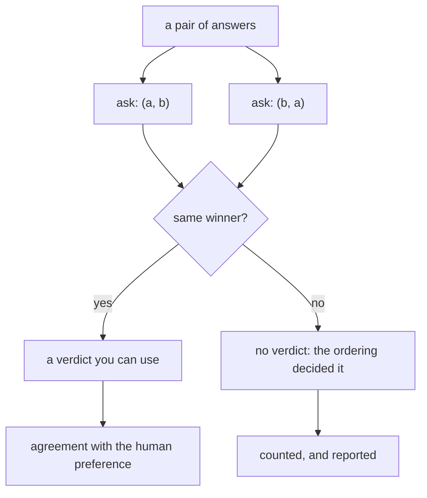

# Paper 01 — Judging the judge: agreement, and the three biases

> **Judging LLM-as-a-Judge with MT-Bench and Chatbot Arena**
> `arXiv:2306.05685` · 2023 · <https://arxiv.org/abs/2306.05685>
> *Record opened on 2026-09-06; the title above is copied from the arXiv abstract page, and the first
> submission is dated 9 June 2023 (§17.4.1 rule 5).*

## One-line answer

It measured a strong LLM judge agreeing with human preferences **over 80% of the time — the same rate
at which humans agree with each other** — and, in the same breath, named the biases that come with it:
position, verbosity, self-enhancement, and limited reasoning.

## The story

A field has a problem it cannot admit is a problem.

The systems being built answer open questions — write a summary, explain this, help me with a letter —
and there is no right answer to compare against. The benchmarks everyone reports on measure something
else: multiple choice, exact-match question answering, tasks with one correct string. The numbers on
those go up. The systems get better in ways the numbers do not capture, and worse in ways they do not
capture either.

So how does anybody tell whether one is better than another?

They ask people. Which is correct, and which is why it does not scale: a proper human comparison of
two systems on a few hundred open questions costs weeks and a budget, so it happens at the end of a
project, once, and cannot be used to make daily decisions. Between those evaluations, teams are flying
on benchmark numbers that everyone privately knows are not measuring the thing.

And there is a folk practice going around, which is to get a strong model to do the comparing. It
works, in the sense that it produces answers that seem reasonable. Nobody has checked. Nobody knows
whether the model's preferences resemble people's, or by how much, or where they systematically do
not.

That is the situation: an evaluation method already in wide use, and no measurement of it.

## The idea in plain language

The paper's contribution is not the technique. Using an LLM to judge outputs was already happening.
Its contribution is to **treat the judge as the object of study** and measure it.

Four things it did, and the fourth is the one this day is built on.

**Two benchmarks.** *MT-Bench*, a set of multi-turn open questions, and *Chatbot Arena*, a platform
where people compare two anonymous systems' answers and pick one. The second matters because it
produces preferences at scale from ordinary users rather than from paid annotators.

**A quantity: agreement.** How often does the LLM judge pick the same answer a person picked? Stated
as a percentage over pairwise comparisons.

**A ceiling, which is the crucial move.** The same question asked of two *people*: how often do two
humans agree with each other on these comparisons? The paper reports the judge reaching *"over 80%
agreement, the same level of agreement between humans."*

That framing is the paper's most transferable idea and it is worth stating on its own. **The right
comparison for a judge is not perfection — it is another judge of the kind you would otherwise have
used.** A number that looks mediocre against 100% is excellent against a human ceiling of 80%, and a
field that had been comparing against an imaginary perfect rater had no way to know that.

**A list of named failure modes.** The abstract names them: *"position, verbosity, and
self-enhancement biases, as well as limited reasoning ability."* Three of the four have a part in this
day:

- **Position** — part [2.1](../parts/02-the-judge-has-biases/2.1-position.md), where twelve verdicts
  became zero once each pair was shown both ways round.
- **Verbosity** — part [2.2](../parts/02-the-judge-has-biases/2.2-verbosity.md), where one polite
  sentence turned four wrong answers into passes.
- **Self-enhancement** — part [2.3](../parts/02-the-judge-has-biases/2.3-self-enhancement.md), where
  two identical facts in two house styles were graded oppositely.
- **Limited reasoning** — not measured in this day. It is the observation that a judge asked to grade
  a maths or logic answer is limited by its own ability at that task, so it cannot reliably grade
  reasoning it could not have produced.

The two halves belong together and are usually quoted apart. *"LLM judges agree with humans 80% of the
time"* is repeated constantly; the list of biases in the same abstract is repeated much less. The
paper's actual position is that this is a **usable** method **with named, measurable defects**, and
both clauses are load-bearing.

## Why Sutra needs it

Because section 2 of this day is the three biases, measured on Sutra's own desk, and every one of them
is an idea from this paper rather than something the lab found on its own. Naming where they came from
is the difference between a curriculum and a list of tricks.

More practically, the paper supplies two things this day could not have produced for itself.

**The control.** Position bias is only detectable by asking twice with the order swapped, and part
[2.1](../parts/02-the-judge-has-biases/2.1-position.md)'s whole method — and part
[4.1](../parts/04-what-it-buys/4.1-priced-against-the-allowance.md)'s `SWAP = 2` term in the cost
arithmetic — is that idea.

**The ceiling.** Part [5.1](../parts/05-in-production/5.1-calibrating-a-judge.md) argues for a
human-labelled calibration set and says the ceiling is not 100%. The number that makes that concrete —
that people agree with each other about 80% of the time on this kind of comparison — is this paper's.

## The mechanism

The method is a pairwise comparison with a control, and it is smaller than its influence suggests.
From `lab/papers/mtbench/arena.py`:

```python
def ask(judge, first: str, second: str, first_name: str, second_name: str) -> str:
    """Show the judge two answers in a given order; it returns 'a' or 'b'."""
    winner = judge(first, second)
    return first_name if winner == "first" else second_name


def verdict(judge, pair: Pair, *, swap_control: bool) -> str | None:
    """The judge's preference for a pair, or None when the two orderings disagree."""
    forward = ask(judge, pair.a, pair.b, "a", "b")
    if not swap_control:
        return forward
    backward = ask(judge, pair.b, pair.a, "b", "a")
    return forward if forward == backward else None
```

**Line by line:**

- `ask` keeps **position** and **identity** separate. The judge answers `"first"` or `"second"` — a
  slot — and `ask` maps that back to `"a"` or `"b"` using the names it was handed. Without that split
  there is no way to express the bias, because the judge's answer would already be about the answers.
- `verdict` calls `ask` twice with the arguments **and the names** exchanged. Exchanging one and not
  the other inverts the second reading and makes every pair look consistent — a bug that produces a
  reassuring result, which is the worst kind.
- `-> str | None`. A disagreement is `None`: not a tie, not a half point, not a default to either
  side. That is the same three-valued discipline Day 78 part 4.4 argued for, and it is what makes the
  control a control rather than a tie-break.
- `swap_control` is keyword-only, so no call site can pass it positionally and leave a reader guessing.
- Two calls per pair. That is the entire cost of the paper's control, and it is the `×2` in part
  [4.1](../parts/04-what-it-buys/4.1-priced-against-the-allowance.md)'s arithmetic.

The shape of the whole method:



## The paper in one demo

Two files, and the only thing they do is put a judge's agreement with people next to the control that
makes it meaningful.

```text
lab/papers/mtbench/
├── arena.py   # ask() and verdict() - the pairwise comparison and the swap control, and nothing else
└── demo.py    # sixteen pairs with human preferences, with and without the control
```

`arena.py` is quoted whole in **The mechanism** above: a `Pair` record and two functions. No I/O, no
configuration, no model. Delete it and the demo stops working; delete anything else and the claim
still lands.

`demo.py` holds the pairs and the judge:

```python
PAIRS = [
    Pair("p01", "how old is 4740?", "Eleven days.", "About a week and a half.", "a"),
    Pair("p02", "how many open?", "Twelve.", "Quite a few.", "a"),
    Pair("p03", "what needs me?", "Two do.", "4688 and 4740 need you.", "b"),
    ...,
]

# The judge reads the answers on most pairs and falls back to "whichever came first" on the rest.
# The five it cannot tell apart are the ones where both answers are short - which is where a
# person hesitates too. Three of the five happen to have the human preferring "a", so ordering gets
# those right by luck and the other two wrong.
POSITION_DRIVEN = {"p01", "p03", "p05", "p09", "p16"}


def make_judge(pair: Pair):
    """The judge for one pair: it prefers the more specific answer, unless it cannot tell."""

    def judge(first: str, second: str) -> str:
        if pair.pair_id in POSITION_DRIVEN:
            return "first"
        better = pair.a if pair.human == "a" else pair.b
        return "first" if first == better else "second"

    return judge
```

**Line by line:**

- Each `Pair` carries the human preference, written down first. Every number the demo prints is
  measured against it.
- The human prefers `a` in nine pairs and `b` in seven, so a judge that always picks one side scores
  near half and has nowhere to hide.
- `POSITION_DRIVEN` is the modelled defect: five pairs the judge cannot tell apart, where it falls
  back on the slot. Five of sixteen is roughly a third, chosen so the effect is visible without
  dominating — a judge that was position-driven on everything would be part
  [2.1](../parts/02-the-judge-has-biases/2.1-position.md)'s caricature rather than this paper's
  finding.
- **Three of the five have the human preferring `a`.** That asymmetry is deliberate and it is what
  makes the ablation interesting: ordering gets three of them right by luck and two wrong, so the
  uncontrolled arm scores well rather than catastrophically. A demo where the bias produced obviously
  bad numbers would not show why anybody keeps doing it.
- `make_judge` closes over the pair, so the judge's behaviour is per-pair. That is how a real judge
  works — it reads some comparisons and guesses on others — and it is what a single global behaviour
  could not express.
- The judge returns `"first"` or `"second"`, never `"a"` or `"b"`. It only knows about slots, which is
  what makes it capable of being position-biased at all.

Run it with the control:

```bash
cd days/day-81-llm-as-judge/lab/papers/mtbench
uv run python demo.py; echo "exit: $?"
```

**Line by line:**

- `cd` into the demo's own directory: `demo.py` imports `arena` by plain name.
- No flag means each pair is shown both ways round and only consistent pairs get a verdict.

Measured on 2026-09-06:

```text
16 pairs, human preferred 'a' in 9 and 'b' in 7
position-swap control: on

  pairs judged:          16
  pairs with a verdict:  11
  agreed with the human: 11
  agreement:             100.0% of the pairs with a verdict
  agreement:             68.8% of all pairs

  5 pairs had no stable verdict: p01, p03, p05, p09, p16
  the judge preferred whichever answer it saw first on those
exit: 0
```

Now switch the paper's control off:

```bash
uv run python demo.py --off; echo "exit: $?"
```

**Line by line:**

- `--off` asks once per pair, which is what a pairwise judge does unless somebody deliberately adds
  the swap.

Measured on 2026-09-06:

```text
position-swap control: off (ablation)

  pairs judged:          16
  pairs with a verdict:  16
  agreed with the human: 16
  agreement:             87.5% of the pairs with a verdict
  agreement:             87.5% of all pairs

  5 of those verdicts were decided by ordering, and nothing here says which
exit: 1
```

**87.5%, sixteen verdicts, and five of them were the ordering.**

Read the ablation's output as a report somebody would circulate. Sixteen pairs judged, sixteen
verdicts, eighty-seven and a half per cent agreement with human preferences — a number in the same
range this paper reports for a strong judge. It is a good result. It is also, on nearly a third of the
pairs, a coin that happened to land right three times out of five.

The controlled arm reports two numbers and both are true: **100% of the pairs it committed on**, and
**68.8% of all pairs**. The first answers *"when this judge gives a verdict, is it right?"*. The
second answers *"can this judge answer my question?"*. Quoting only the first is the standard way a
pairwise result is overstated, and it is not dishonesty — it is picking the denominator the control
produced.

And the five dropped pairs are `p01`, `p03`, `p05`, `p09` and `p16`, which are the ones where both
answers are short. The judge lost exactly the comparisons where the two options were closest, which
is where the paper's finding bites hardest and what part
[2.1](../parts/02-the-judge-has-biases/2.1-position.md)'s **When it breaks** section is about.

## When it breaks

The paper's claim is measured, bounded, and quoted far beyond its bounds. Four limits.

**"Over 80%" is a number about particular models, tasks and raters in 2023.** The judges were the
strongest models then available; the tasks were MT-Bench's open questions and Arena's chat
comparisons; the human preferences came from a mix of experts and crowd users. None of those transfers
automatically. A cheaper judge, a narrower domain, or a different labelling population gives a
different number, and the only way to know yours is part
[5.1](../parts/05-in-production/5.1-calibrating-a-judge.md)'s calibration set.

**Agreement with human preference is not correctness.** People prefer answers that are confident,
well-formatted and long, and a judge that matches human preference matches those preferences too. On a
question with a factually right answer, agreement with a crowd is a weaker target than being right —
and *"which of these two is better"* is a different question from *"is this one correct"*, which is
what ADK's `final_response_match_v2` asks.

**The biases are named, not solved.** The paper reports the swap control for position; verbosity and
self-enhancement are identified and have no equivalent cheap fix. Part
[2.3](../parts/02-the-judge-has-biases/2.3-self-enhancement.md) is blunt about that: there is no
control you can run in one command, and detecting it needs a second judge from another family or human
labels.

**"Limited reasoning ability" is the limit people forget.** A judge cannot reliably grade reasoning it
could not perform. For a support desk that mostly restates facts this matters little; for grading a
proof or a calculation it is the whole story, and it does not improve by sampling more.

There is also a structural limitation worth naming, because this curriculum keeps running into it: the
method assumes you can afford many judge calls. Part
[4.1](../parts/04-what-it-buys/4.1-priced-against-the-allowance.md) priced a sixty-pair arena with the
swap control at 1,200 requests against a measured daily allowance of 20. The technique transfers
unchanged; the *scale* it was demonstrated at does not.

## In production

**What survived.** The framing, almost completely. **LLM-as-a-judge is now a standard evaluation
method**, and the specific practices this paper introduced are the ones people actually use: pairwise
comparison, the position-swap control, and — most importantly — reporting agreement **against a human
ceiling** rather than against perfection. That last one changed how results are read, and it is the
half of the paper this curriculum leans on hardest.

The vocabulary survived too. *Position bias*, *verbosity bias* and *self-enhancement bias* are the
terms people use when discussing why a judged number moved, and they came from here.

And the deeper move survived: **evaluating the evaluator**. Before this line of work, an evaluation
method was something you adopted; after it, an evaluation method is something you measure. That is the
same reframing Day 79's Principle 11 — evals are tests — applies to eval suites, and it is why part
[5.1](../parts/05-in-production/5.1-calibrating-a-judge.md) treats a judge as an instrument needing
calibration.

**What did not.** The specific benchmarks. MT-Bench's questions are a fixed set from 2023 and are
saturated and contaminated — they appear in training data, so scores on them no longer separate
systems. Chatbot Arena outlived the paper as a live service rather than as a dataset. The general
lesson is one this curriculum has met before: a benchmark is a perishable good and a methodology is
not.

The reported agreement figure did not survive as a constant either. Quoting *"LLM judges agree with
humans 80% of the time"* as a general fact is the most common misuse of this paper, and it is the
misuse that stops teams building their own calibration set — because the number has already been
supplied by somebody else, for somebody else's judge, on somebody else's task.

## Check yourself

```bash
cd days/day-81-llm-as-judge/lab/papers/mtbench
uv run python demo.py; echo "exit: $?"
uv run python demo.py --off; echo "exit: $?"
```

The controlled run prints two agreement figures. Say what question each one answers, and which you
would put in a report — and what you would put next to it.

Now add `"p07"` to `POSITION_DRIVEN` and predict, before running, what happens to each of the four
numbers in the controlled arm and to the ablation's agreement figure. Look up `p07`'s human preference
first; it decides one of the five.

**Out loud:** what did this paper actually claim, and what do we do differently now? The answer has
two halves — the control, which is used unchanged, and the "80% agreement" figure, which is quoted far
more often than it is re-measured.

**Back to:** [the hub](../LESSON.md).
