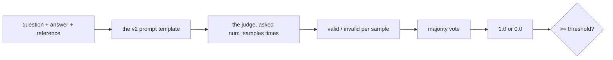

# 1.1 — A judge is a model with a job description

## One-line answer

`final_response_match_v2` asks a model whether an answer means the same as a reference, samples it
five times, and takes the majority — which makes it a metric whose output depends on a system you did
not write, did not test, and cannot see inside.

## The story

The clerk at the counter who checks whether two signatures match.

There is a specimen signature on the account record and there is one on the withdrawal slip in front
of him. He looks at both, for about two seconds, and decides.

He is not comparing pixels. Nobody signs their name identically twice and everybody knows it — the
loops are different sizes, the pen was different, the counter is at a different height. What he is
doing is a judgement: *is this the same hand?* And it is a real skill, and he is mostly right.

He is also a person having a day. He is quicker after lunch and slower at four. He is more careful
with a large amount than a small one. If you handed him the same slip twice, an hour apart, there is a
version of it — a rushed signature, a bad photocopy — where he would pass it once and query it once.

None of that makes him the wrong tool. Nothing else in the building can do what he does. It means
that when the bank writes down *"signatures are verified at the counter"*, it has written down a
control whose reliability is a property of a person, and somebody ought to know how reliable.

## The idea in plain language

[Day 79 part 3.3](../../../day-79-evals-are-tests/parts/03-two-metrics-that-cost-nothing/3.3-response-match-and-the-word-not.md)
measured the wall the mechanical metrics hit: ROUGE scored a true sentence at 0.353 and its negation
at 0.941. The conclusion was that word overlap is a wording-drift detector and the correctness
question needs a reader.

Day 80 brought a reader in and kept it scripted, so that everything *around* the reader could be
measured for free. Today the reader is the subject.

**LLM-as-a-judge** is the pattern: use a language model to grade another language model's output.
ADK's version for final answers is `final_response_match_v2`, and `adk.dev/evaluate/criteria/`
describes it as using *"a Large Language Model (LLM) as a judge to determine if the agent's final
response is semantically equivalent to the provided reference response"*, adding that it is
*"designed to be more flexible than lexical matching metrics"* and *"focuses on whether the agent's
response contains the correct information, while tolerating differences in formatting, phrasing, or
the inclusion of additional correct details."*

That is exactly the gap ROUGE could not cross, and the mechanism has three parts:

- **A prompt with a job description in it.** The evaluator builds it from a fixed template plus the
  question, the agent's answer and the reference answer. Part
  [1.3](1.3-what-the-judge-is-shown.md) reads it.
- **A label, not a score.** The judge answers `valid` or `invalid`, which is mapped to 1.0 or 0.0.
  There is no partial credit at the level of one sample.
- **Repetition and a vote.** The same question is asked `num_samples` times and the majority wins,
  because — as the field's own documentation says — models "tend to have certain degree of
  unreliability to them". Part [1.2](1.2-the-judge-disagreed-with-itself.md) is what that hides.

And the thing to hold on to, which is the whole reason this day exists: **the metric now has a
dependency on a system nobody in your team wrote.** A ROUGE score is arithmetic; you can reason about
it completely. A judged score is the output of a model with its own version, its own quirks and its
own bad days, and everything in sections 2 and 3 follows from taking that seriously.

## Why Sutra needs it

Because the plan's day-81 title is *"LLM-as-judge & honest baselines"*, and the two halves are one
argument: a judge is a measuring instrument, and an instrument that has not been calibrated is a
number generator.

It is also the metric Day 83's phase gate leans on. Day 79's two deterministic metrics cannot say
whether an answer is *right*; Day 80's rubric can say whether a conversation followed the rules. The
question *"did the desk answer this correctly?"* has no other mechanism in this curriculum, so if the
judge is not trustworthy, that question is unanswered.

## The mechanism

The evaluator, built with an explicitly pinned judge model. From `lab/judge.py`:

```python
def build() -> FinalResponseMatchV2Evaluator:
    criterion = LlmAsAJudgeCriterion(
        threshold=THRESHOLD,
        judge_model_options=JudgeModelOptions(judge_model=_judge.JUDGE_MODEL, num_samples=SAMPLES),
    )
    return FinalResponseMatchV2Evaluator(
        EvalMetric(metric_name=METRIC, threshold=THRESHOLD, criterion=criterion)
    )
```

**Line by line:**

- `LlmAsAJudgeCriterion` rather than the plain `BaseCriterion` Day 79 used for the deterministic
  metrics. On the installed `google-adk==2.7.1` its fields are `threshold`,
  `include_intermediate_responses_in_final` and `judge_model_options` — the last of which is what
  makes it a judged metric.
- `judge_model=_judge.JUDGE_MODEL` is **pinned explicitly**, and that is not optional. The default on
  2.7.1 is `gemini-2.5-flash`, which is the desk's own lane — Day 79 part 4.2 measured what that
  costs, and it is ADK-73's trap applied to a model call that does not look like one.
- `num_samples=SAMPLES` is written out even though 5 is the default, so the run's cost is visible at
  the call site rather than requiring a reader to know a library default.
- `FinalResponseMatchV2Evaluator.__init__` takes **only** an `EvalMetric` — no threshold argument, no
  judge argument. Everything travels inside the criterion. That differs from
  `TrajectoryEvaluator(threshold=...)` in Day 79 part 3.1, and the inconsistency is worth knowing
  before you spend twenty minutes on a `TypeError`.
- Constructing this warns, because both `LlmAsJudge` and `FinalResponseMatchV2Evaluator` carry ADK's
  `@experimental` decorator on 2.7.1:

  ```text
  UserWarning: [EXPERIMENTAL] FinalResponseMatchV2Evaluator: This feature is experimental and may
  change or be removed in future versions without notice. It may introduce breaking changes at any
  time.
  ```

And the call, which is `await`ed because a judged metric is asynchronous where the deterministic ones
were not:

```python
        result = await evaluator.evaluate_invocations(
            actual_invocations=[invocation(answer.said, answer.question)],
            expected_invocations=[invocation(answer.reference, answer.question)],
        )
        said = "valid" if result.overall_score == 1.0 else "invalid"
```

**Line by line:**

- `expected_invocations` is **required** here. `FinalResponseMatchV2Evaluator` compares against a
  reference, so a case with no expected answer cannot be graded by it — unlike Day 80's rubric metric,
  which needs no reference at all.
- Both arguments are named. They are the same type, and swapping them silently grades the reference
  against the answer, which is a plausible-looking number from a completely inverted comparison.
- `result.overall_score == 1.0` converts back to a label. For a single case the score is the fraction
  of invocations judged valid, so with one invocation it is 1.0 or 0.0 — and part
  [1.2](1.2-the-judge-disagreed-with-itself.md) is about what that clean number was made from.

The judge itself is scripted and registered through `LLMRegistry`, the same seam Day 80 part 2.1
established, so the whole of this runs at zero requests with ADK's real evaluator, parser, vote and
threshold.



Run it with a judge that gives the human's verdict on every case:

```bash
cd days/day-81-llm-as-judge/lab
uv run python judge.py; echo "exit: $?"
```

**Line by line:**

- `cd` first: every script in this lab imports `_cases` and `_judge` by plain name, the convention
  days 73 to 80 use.
- No flag installs a judge that answers exactly as the person who labelled the fixture did — the
  best possible judge, as a control.

Measured on 2026-09-06:

```text
metric: final_response_match_v2, threshold 1.0, num_samples 5
judge: gives the human verdict
cases: 24

  judge agreed with the human on 24 of 24 cases
exit: 0
```

Twenty-four of twenty-four. That is the metric working: the real evaluator, the real prompt, the real
parser, the real vote, and a rater that reads correctly. It is also the last completely comfortable
number in this day.

## When it breaks

The first thing that breaks is the judge's answer format, and ADK handles it the way Day 80 part 3.3
found the rubric parser does — by refusing to guess.

`_parse_critique` on 2.7.1 looks for a JSON field:

```text
"is_the_agent_response_valid": "valid"
```

and maps `valid`/`true` to `VALID`, and `invalid`/`almost`/`false`/`partially valid` to `INVALID`.
Anything else is `Label.NOT_FOUND`, which produces an `AutoRaterScore` with no score, which becomes
`EvalStatus.NOT_EVALUATED` — a case with no verdict rather than a failing one.

The mapping is worth reading twice, because one entry in it is a policy rather than a parse:
**`partially valid` maps to `INVALID`.** A judge that hedges is recorded as having said no. That is
a defensible default and it is a default, and a suite whose judge hedges often is failing cases on a
mapping decision somebody at Google made.

The second thing that breaks has no message at all, and it is the reason this day continues: the
judge answers confidently and wrongly. Every remaining part of this day is about a specific way that
happens.

## In production

**What a professional pins.** The judge model, by exact name, in the config — and the model's version
in every results file. A judged score is only comparable with another judged score if both were
produced by the same rater, and a model that is silently upgraded underneath you changes your metric
without changing your code. This is the same discipline Day 79 part 4.2 asked for and it matters more
here, because this metric has no deterministic component at all to anchor it.

**What degrades at scale.** Judged metrics are the slow part of a suite. Twenty-four cases at five
samples is 120 sequential model calls, and they do not parallelise for free against a rate limit —
which is how a nightly eval run starts overrunning its window, and then somebody reduces
`num_samples`, and part [1.2](1.2-the-judge-disagreed-with-itself.md) is why that is the wrong lever.

**The failure that only shows with real traffic.** The reference answers were written by somebody on
your team, in your house style. A judge asked whether the desk's answer is *"semantically
equivalent"* to a reference will be more forgiving of answers that read like the reference and less
forgiving of ones that do not — which is part
[2.3](../02-the-judge-has-biases/2.3-self-enhancement.md)'s subject, and it means the metric quietly
rewards the desk for sounding like whoever wrote the fixture.

**The review comment a senior engineer leaves:** *"Pin the judge model in the config and put the model
string in every results row. And note somewhere findable that `partially valid` maps to invalid —
when our judge starts hedging, and it will, I want us to know that we are failing those cases by
somebody else's default rather than by our own decision."*

**The interview question:** *"You are using an LLM to grade another LLM's output. What is the first
thing you would want to know?"* The answer that shows experience does not talk about prompt design.
It asks how well the judge agrees with a person, and what that agreement would be for a trivial
baseline — which is section 3, and which is the question that decides whether any of the rest matters.

## Check yourself

```bash
cd days/day-81-llm-as-judge/lab
uv run python judge.py; echo "exit: $?"
uv run python -c "
from google.adk.evaluation.final_response_match_v2 import Label
print([(x.name, x.value) for x in Label])"
```

The second command prints the label vocabulary the parser accepts. Find the entry that is a policy
rather than a synonym, and say which way it decides a hedge.

Now open `_cases.py` and read the four answers marked `invalid`. For each one, say in a few words why
a person marked it wrong — and notice that one of the four is wrong by a single word.

**Out loud, without scrolling up:** what does this metric have that `response_match_score` does not,
and what does it depend on that no arithmetic metric does?

**Next:** [1.2 — The judge disagreed with itself](1.2-the-judge-disagreed-with-itself.md).
