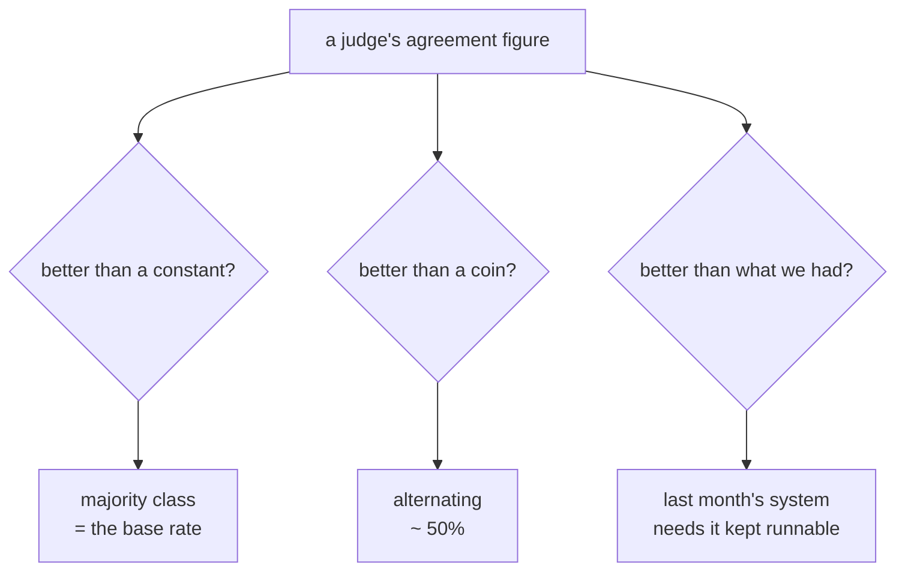

# 3.2 — Three baselines you can always build

## One-line answer

Three baselines cost nothing and answer three different questions — **majority class** (is this
better than a constant?), **alternating** (better than a coin?), and **last month's system** (better
than what we already had?) — and the third is the one nobody builds and the only one that answers the
question a team actually has.

## The story

The mechanic who says *"it's the battery"* before opening the bonnet.

He is right about seven times in ten. Not because he is guessing wildly — he has seen thousands of
cars that would not start, and most of them were the battery. It is a good prior, cheaply applied, and
it saves everyone time on most days.

Now suppose somebody builds a diagnostic tool, plugs it in, and it says *"battery"*. It was right! It
agreed with the outcome! Somebody writes down: **seventy per cent accurate.**

The number is true and the tool has demonstrated nothing, because the man who did not open the bonnet
scores the same. And there is a second, better question hiding behind the first one, which is the one
the workshop actually cares about: does the tool beat **the mechanic**? He is right seven times in
ten and he is also right about *which* three — he knows the ones where it is not the battery. That is
a much harder thing to beat and it is what buying the tool is competing against.

## The idea in plain language

Part [3.1](3.1-a-number-needs-a-baseline.md) said a number needs something to be better than. This
part is the shortlist, and each entry answers a question the others cannot.

**1. Majority class.** Always predict the most common label. Its score is the base rate. It answers:
*is this better than a constant?* — and on skewed data it is a much stronger competitor than people
expect. It is the baseline that catches part
[1.2](../01-the-judge-is-a-system/1.2-the-judge-disagreed-with-itself.md)'s coin judge.

**2. Alternating, or random.** Produce both labels, ignoring the input. It lands near 50% whatever the
skew. It answers a different question: *is this better than a coin?* On skewed data it is a **weak**
competitor, which is why it is the baseline that flatters — comparing against random when the majority
class is 83% makes a useless system look like a thirty-point win.

**3. The previous version.** Whatever you were running last month. It answers the only question a team
ever actually has, which is *is this an improvement?*

The third is the one that gets skipped and it is worth being clear about why: the first two can be
computed from the labels you already have, in one line each, while the third needs the old system to
still be runnable. That means keeping a pinned version, its config, and the ability to run it — which
is real work, done in advance, for a benefit that only shows up later.

A fourth is worth naming even though it is not a baseline in the same sense: **a person's score on the
same set**. It is the ceiling rather than the floor, and it is rarely 100% — two people labelling the
same answers will disagree, which is precisely what
[Day 80's paper part](../../../day-80-rubrics-and-trajectories/papers/01-agreement-above-chance.md)
measures. A judge at 95% against a human ceiling of 96% is doing extremely well; the same judge
against an assumed ceiling of 100% looks mediocre.

Put together, a report with these looks like a range rather than a number:

| | Answers | On this fixture |
| --- | --- | --- |
| always invalid | the weak constant | 16.7% |
| alternating | better than a coin? | 50.0% |
| **always valid** | **better than a constant?** | **83.3%** |
| the judge | | 95.8% |
| a second person | the ceiling | not measured |

The bolded row is the one that matters, and it is the one nobody puts on the slide.

## Why Sutra needs it

Because Day 82 turns this suite into a nightly comparison, and *"is this an improvement?"* is exactly
what a nightly comparison is for. Without baseline 3 — the previous version — a nightly run can only
say the number moved, and a number that moves has at least three explanations: the desk changed, the
judge changed, or the mix of tickets changed.

And because the two cheap baselines are one line each and Sutra has never computed them. That is not
negligence; it is that nothing asked for them until the day the judge turned out to be a coin.

## The mechanism

All three, as label lists. From `lab/baseline.py`:

```python
    candidates = [
        ("the judge (3-2 coin)", COIN_JUDGE),
        ("the judge (reads it)", GOOD_JUDGE),
        (f"baseline: always {majority_label}", [majority_label] * n),
        ("baseline: always invalid", ["invalid"] * n),
        ("baseline: alternating", ["valid" if i % 2 else "invalid" for i in range(n)]),
    ]
```

**Line by line:**

- `[majority_label] * n` — baseline 1, in eleven characters. `majority_label` comes from
  `Counter(HUMAN).most_common(1)`, so it adapts when the class balance flips rather than assuming
  `"valid"`.
- `["invalid"] * n` is the *minority*-class constant. It is not a serious competitor and it is in the
  table to show the range: a reader who sees 16.7% and 83.3% understands immediately that the two
  constants are not symmetric, which is the fact that makes skew visible.
- The alternating baseline is a comprehension over `range(n)`, so it is deterministic. A random
  baseline would need a seed to be reproducible and would add a number to explain; alternating gives
  the same 50% with nothing to configure.
- **Baseline 3 is not in this list**, and its absence is the point of the part. It cannot be a label
  list computed from `HUMAN` — it has to come from running an older system, which is why it is a
  `TODO(me)` in the hub rather than a line here.

And the scoring, which treats every row identically:

```python
    for name, labels in candidates:
        a = agreement(HUMAN, labels)
        over = a - base_rate
        print(f"  {name:<26}{a:>10.1%}{kappa(HUMAN, labels):>8.2f}{over:>+15.1%}")
```

**Line by line:**

- One loop over judges and baselines together. There is no branch that treats a judge differently from
  a constant, which is what makes the comparison honest — the same function, the same formatting, the
  same row.
- `over = a - base_rate` is the margin, computed against **baseline 1** specifically. Choosing which
  baseline the margin is measured against is a decision, and it is the strongest one, which is the
  conservative choice.
- `{over:>+15.1%}` forces a sign, so `+0.0%` is visually different from `0.0%` and a zero margin
  reads as a result rather than as a blank.
- `kappa(HUMAN, labels)` is Day 80's correction, applied to every row. It is worth watching what it
  does to the baselines: all three come out at exactly `0.00`, which is the arithmetic confirming that
  a procedure ignoring the input has no agreement chance does not explain.

The three questions, and which baseline answers each:



Run it:

```bash
cd days/day-81-llm-as-judge/lab
uv run python baseline.py
```

**Line by line:**

- No flag: all five rows, with the base rate printed above them.

Measured on 2026-09-06:

```text
24 answers, human labels: {'valid': 20, 'invalid': 4}
majority class 'valid' is 83.3% of the suite

                             agreement   kappa  over baseline
  the judge (3-2 coin)           83.3%    0.00          +0.0%
  the judge (reads it)           95.8%    0.83         +12.5%
  baseline: always valid         83.3%    0.00          +0.0%
  baseline: always invalid       16.7%    0.00         -66.7%
  baseline: alternating          50.0%    0.00         -33.3%
```

**Read the coin judge against each baseline in turn and watch the story change.** Against
`alternating` it is +33.3 points and looks excellent. Against `always invalid` it is +66.7 and looks
extraordinary. Against `always valid` it is **+0.0** and is revealed.

That is why "compare against a baseline" is not sufficient advice. The baseline has to be the
**strongest trivial procedure available**, and on skewed data that is always the majority class. A
report comparing against random on an 83%-skewed set is not making an error of arithmetic; it is
choosing the flattering comparison, and it is the single most common way an evaluation result is
overstated.

## When it breaks

The two cheap baselines are cheap because they need only the labels. Baseline 3 needs the old system,
and that is where it breaks — not on the day you want it, but months earlier, on the day nobody kept
it.

What you have instead, at that moment, is a number from March in a document. And a number from March
is not comparable with a number from September for at least three reasons, none of which is visible in
either number: the labelled set has grown, the class balance has moved, and the judge model has been
upgraded. Part [2.3](../02-the-judge-has-biases/2.3-self-enhancement.md) is why the third one matters
most and is the least likely to be recorded.

There is no error. The failure is a comparison somebody makes in good faith between two numbers that
were never on the same scale.

The smallest fix is a habit with a cost, and it should be stated with the cost attached: **pin the
previous version and keep it runnable.** Concretely — the agent's config, the judge model string, and
the evalset, all tagged together, so that "run last month's system on this month's set" is one command
rather than an archaeology project. Day 82's regression discipline is where this lands, and it is
cheap to set up now and expensive to reconstruct later.

## In production

**What a professional keeps.** A frozen previous version, runnable, and re-run on **the current
evaluation set** rather than compared against its own old score. That distinction is the whole of it:
comparing a new score against an old score compares two runs on two sets; re-running the old system
compares two systems on one set, which is the only comparison that isolates the change.

**What degrades at scale.** Baselines rot. The majority class flips as the system improves, the old
version stops running because a dependency moved, and the labelled set grows so that this quarter's
numbers are not on last quarter's population. Every one of those is silent, and the compounding effect
is that after a year the only honest comparison anybody can make is against the two constants — which
are the weakest of the three.

**The failure that only shows with real traffic.** The previous version is usually not available for
the reason that matters: it was a hosted model that has been deprecated. A pinned config does not help
if the model behind it no longer exists, which means the "previous system" baseline has an expiry date
set by somebody else. The practical answer is to record the old system's **outputs** on a fixed set,
not just its config, so the comparison survives the model's retirement.

**The review comment a senior engineer leaves:** *"Add the majority-class row to the table now — it is
one line and it would have caught the coin judge on day one. And put keeping last month's version
runnable on the sprint. I know it feels like housekeeping; it is the only baseline that answers the
question anybody is actually asking, and we will not be able to reconstruct it in six months."*

**The interview question:** *"What do you compare a new model against?"* The answer that shows
experience gives three — a trivial constant, a chance procedure, and the incumbent — and then says
which one is hard: keeping the incumbent runnable. A candidate who only names random has not worked on
skewed data, and one who only names the incumbent has not been surprised by a base rate.

## Check yourself

```bash
cd days/day-81-llm-as-judge/lab
uv run python baseline.py
```

For the coin judge, compute its margin against each of the three baselines in the table. Say which one
you would put in a report and why the other two are not wrong, only flattering.

Now write down, in three lines, what you would have to store today to be able to run baseline 3 in six
months. One of the three lines is not a file, and the **In production** section says why.

**Out loud, without scrolling up:** name the three baselines and the question each one answers. Which
of the three needs work done in advance, and what happens if you skip it?

**Next:** [3.3 — The 95.8% that was 83.3% for free](3.3-the-eighty-seven-that-was-eighty-three.md).
