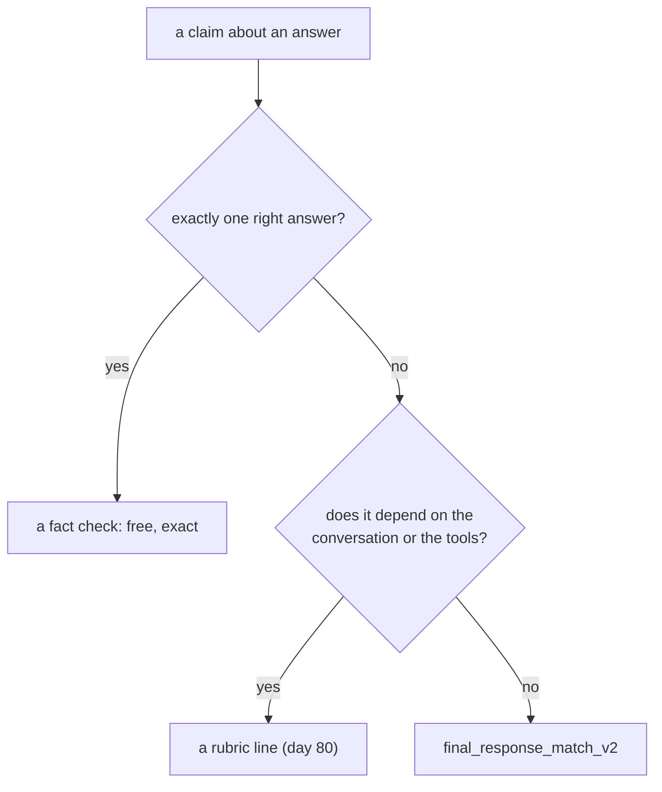

# 4.2 — When a judge is the wrong tool

## One-line answer

A judge is for questions with **no single right answer**; every claim that has one — a tool was
called, a number appears, an order was followed — has a cheaper, deterministic, free check, and using
a model for those buys nothing and adds a rater's biases to a question that had none.

## The story

Using a weighing scale to find out how long something is.

You can do it. Put the thing on the scale, note the reading, look up the density, work back to a
volume, and if you know the cross-section you have a length. It will be roughly right. Somebody
watching would not be able to say the number is wrong.

They would say: there is a ruler on the shelf.

The scale is a good instrument and this is a bad use of it — not because it fails, but because the
ruler answers this question exactly, instantly, for nothing, and with no assumptions about density.
Every step in the scale method is a place for the answer to drift, and none of those steps buys
anything.

The tell is that you had to look something up. If a measurement needs an intermediate assumption, the
instrument is probably wrong for the question.

## The idea in plain language

By now this curriculum has four ways to check a thing, and they are not interchangeable. The useful
skill is picking, and the rule is short: **use the cheapest instrument that can answer the question.**

| Claim | Instrument | Cost | Day |
| --- | --- | --- | --- |
| "the answer contains `4740` and `eleven`" | a string check in a test | free, exact | 23 |
| "the desk called `ticket` exactly once" | `tool_trajectory_avg_score` | free, exact | 79 |
| "the wording has not drifted" | `response_match_score` (ROUGE) | free, arithmetic | 79 |
| "it escalated before any write" | a rubric line over the conversation | judged, per conversation | 80 |
| "this answer means the same as the reference" | `final_response_match_v2` | judged, per answer | 81 |

Reading down the table, the cost rises and so does the *kind* of question. The first three are facts
about text or structure. The last two are readings, and you pay for a reader.

Three tests for whether you have reached down too far:

**Is there exactly one right answer?** If yes, do not use a judge. *"Did the desk say twelve?"* has
one answer, and a substring check answers it in microseconds with no bias, no sampling and no bill.

**Could a regular expression get it right?** Not "would it be elegant" — could it be correct? A claim
about a number, an identifier, a required phrase or a forbidden one is usually a pattern, and a
pattern that is right is better than a rater that is usually right.

**Does the claim depend on anything outside the final answer?** If yes, `final_response_match_v2` is
the wrong judge specifically, because part
[1.3](../01-the-judge-is-a-system/1.3-what-the-judge-is-shown.md) measured that only three values
reach it. Day 80's rubric metric sees the conversation; this one does not.

And the reverse mistake is real too, and it is the one Day 79 spent a part on: using a cheap
instrument for a reading. `response_match_score` scored a true sentence at 0.353 and its negation at
0.941 — the ruler applied to a weight. Both errors are the same error in opposite directions.

## Why Sutra needs it

Because part [4.1](4.1-priced-against-the-allowance.md) priced this metric at 240 requests for
twenty-four cases against a measured allowance of 20 a day, and the cheapest way to afford a judged
suite is **not to judge the cases that do not need judging**.

Look at the fixture. Of the twenty-four answers in `_cases.py`, a large fraction are claims about a
number or an identifier — *"Four sign-in tickets"*, *"The limit is 1,000"*, *"Twelve open"*. Every one
of those is checkable with a substring test that costs nothing and cannot be wrong. Judging them is
paying ten requests each for a rater's opinion about a fact.

## The mechanism

The two instruments, on the same claim, side by side. First the free one:

```python
def contains_facts(said: str, facts: tuple[str, ...]) -> bool:
    """Every required fact appears in the answer. Exact, free, and cannot be biased."""
    lowered = said.lower()
    return all(fact.lower() in lowered for fact in facts)
```

**Line by line:**

- `facts` is a tuple of required substrings — `("4740", "eleven")` for the age question. It says what
  must be present and deliberately says nothing about wording, so the correct rewordings that
  [Day 79 part 3.3](../../../day-79-evals-are-tests/parts/03-two-metrics-that-cost-nothing/3.3-response-match-and-the-word-not.md)
  measured ROUGE failing all pass.
- `.lower()` on both sides, once for the answer rather than per fact. Case is not a fact about a
  ticket age.
- `all(...)` — every fact, not any. A partial answer is not a pass, and using `any` here is the kind of
  mistake that produces a check which is nearly always green.
- It returns a `bool`, not a score, because the question is a yes-or-no and dressing it as a score
  invites a threshold that does not mean anything.
- **What it cannot do** is notice the negation. *"4740 has **not** been open eleven days"* contains
  both facts and passes. That is the honest limit of this instrument and it is why the table above has
  more than one row — a fact check catches the wrong number and a judge catches the reversed claim.

And the judged one, from part [1.1](../01-the-judge-is-a-system/1.1-a-judge-is-a-model-with-a-job.md):

```python
        result = await evaluator.evaluate_invocations(
            actual_invocations=[invocation(answer.said, answer.question)],
            expected_invocations=[invocation(answer.reference, answer.question)],
        )
```

**Line by line:**

- Same claim, ten requests — five samples times two runs — a rater's biases from section 2, and an
  answer that may come back `NOT_EVALUATED`.
- It *can* catch the negation, which the fact check cannot, and that is the entire reason to pay.
- `await`, because the judged path is asynchronous where the fact check is a function call.

The decision, drawn:



You can see the cost difference without running anything:

```bash
cd days/day-81-llm-as-judge/lab
uv run python cost.py | head -6
```

**Line by line:**

- `head -6` because only the first block matters here: twenty-four cases, ten calls each.

Measured on 2026-09-06:

```text
suite: 24 single-answer cases
num_samples 5, num_runs 2

  final_response_match_v2, one answer at a time:
    24 cases x 5 samples x 2 runs            240 calls
```

Now count how many of those twenty-four are claims a substring test settles. Open `_cases.py` and read
the `VALID` list: `v04` is *"There are twelve open right now"*, `v07` is *"Four sign-in, four billing,
four export"*, `v09` is *"The limit is 1,000"*, `v18` is *"Four sign-in tickets"*. Each is a number
appearing or not appearing.

**Moving those to fact checks removes ten requests each from the bill and adds a check that cannot be
wrong.** The judged budget then goes on the cases that genuinely need a reader — the ones where the
desk hedged, or explained, or answered a slightly different question than the one asked.

## When it breaks

Reaching for a judge when a check would do is not usually a decision. It is a **default**, and the
default has two causes worth naming.

**The judge is already wired up.** Once `final_response_match_v2` is in the config, adding a case to it
is one entry in a file, and writing a fact check is a small piece of code somebody has to put
somewhere. The path of least resistance points at the expensive instrument.

**A judged score is a number and a fact check is a boolean.** Dashboards like numbers. A suite of
booleans is harder to average into something that looks like progress, so claims get promoted into the
judged metric to make the chart nicer — and part
[3.3](../03-honest-baselines/3.3-the-eighty-seven-that-was-eighty-three.md) is what happens to charts
built that way.

There is no error for either. What you get is a suite that costs ten times what it needs to and whose
deterministic claims now carry a rater's biases: a fact check cannot be verbose-biased, and the same
claim judged can be — part [2.2](../02-the-judge-has-biases/2.2-verbosity.md) turned four wrong
answers into passes with one polite sentence, and every one of those four was a claim about a number.

The smallest fix is a rule applied when a case is written rather than when the bill arrives: **write
down the claim in one sentence first, then pick the instrument.** If the sentence contains a number, an
identifier or a tool name, it is probably not a judged case.

## In production

**What a professional builds.** A layered suite. Fast deterministic checks on every case, on every
commit; the judged metric on a subset, on a schedule. The subset is chosen by a property, not by
convenience — cases where the answer is open-ended, cases that have been complained about, cases near
a decision boundary — and everything else is checked for free.

**What degrades at scale.** The judged set grows and nobody prunes it, exactly as evalsets do. Cases
get added to the judged metric because that is where cases go, and after a year most of them are
claims that a regular expression would settle, at ten requests each, every night. The audit worth
doing once a quarter is: *which of our judged cases has a deterministic answer?* — and the answer is
always more than anybody expects.

**The failure that only shows with real traffic.** A fact check that was exactly right becomes subtly
wrong as the product changes. `"1,000"` stops matching when the desk starts writing `"1000"` or
`"₹1,000"`, and the check goes red on a correct answer — which is the brittleness that makes people
abandon deterministic checks and reach for a judge. The answer is not to abandon them; it is to write
the fact as the thing that must be true (`"1000" in said.replace(",", "")`) rather than as the string
that happened to be there.

**The review comment a senior engineer leaves:** *"Half of these judged cases are asserting that a
number appears in a sentence. Move them to fact checks — free, exact, and they run on every commit
instead of nightly. Keep the judge for the four or five where the desk has to say something a person
would have to read. And when you move them, write down the claim above each one; if you cannot state
it in a sentence, it is not ready to be either kind of check."*

**The interview question:** *"When would you not use an LLM to evaluate?"* The answer that shows
experience gives the test rather than a list: if there is exactly one right answer, or a pattern that
is correct, use the deterministic check — it is free, exact, unbiased and runs on every commit. The
tell is whether they also name the reverse error, because a team that has learned this lesson too hard
starts using string checks for questions that need a reader.

## Check yourself

```bash
cd days/day-81-llm-as-judge/lab
uv run python cost.py | head -6
```

Open `_cases.py` and go through the twenty answers in `VALID`. For each, decide: fact check, or judge?
Count them. Then multiply the fact-check count by ten and say what that is as a fraction of 240.

Now take the one claim in this day that a fact check **cannot** settle — it is in `INVALID`, and part
[2.2](../02-the-judge-has-biases/2.2-verbosity.md) mentions it — and say in one sentence why a
substring test passes an answer that is exactly wrong.

**Out loud, without scrolling up:** you have five instruments and one claim. What is the question you
ask to choose, and what does using the expensive one on an easy claim add besides cost?

**Next:** [5.1 — Calibrating a judge against people](../05-in-production/5.1-calibrating-a-judge.md).
