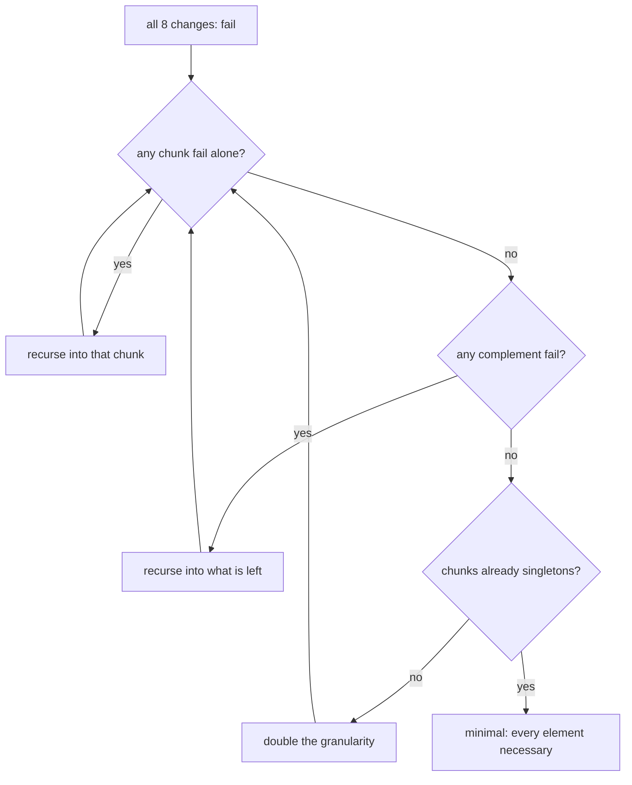

# Paper 01 — Which change broke it: narrowing by experiment

> **Yesterday, my program worked. Today, it does not. Why?**
> ACM SIGSOFT Software Engineering Notes, Volume 24, Issue 6, November 1999, pages 253–267
> `doi:10.1145/318774.318946` · <https://doi.org/10.1145/318774.318946>
> *Record checked on 2026-09-06 via `api.crossref.org/works/10.1145/318774.318946`; the title,
> journal, volume, issue, pages and year above are copied from the Crossref record rather than from
> memory (§17.4.1 rule 5).*

## One-line answer

When a set of changes breaks something, the cause can be found by **experiment rather than by
reading** — and the demo below isolates a pair of changes that only break together in 34 runs out of
256 possible subsets, where trying each change on its own finds nothing at all.

## The story

The washing machine will not start, and eleven things happened yesterday.

The electrician was in. Somebody moved the machine to clean behind it. A new plug board went in. The
water was off for two hours in the morning. The child was playing with the dial. It rained heavily and
the balcony flooded a little. Somebody put a heavier load in than usual. The power went off twice. The
tap behind the machine was turned. A pipe was reconnected. And the neighbour's borewell pump was
running.

You can look at the machine and think about it. Everybody does this first, and everybody has a
favourite theory within about ten seconds, and the theory is usually the most recent thing or the most
memorable thing rather than the most likely thing.

What actually finds it is duller and works: put the tap back, try it. Move it back, try it. Old plug
board, try it. You are not reasoning about the machine at all — you are undoing things and observing,
and the observation settles what no amount of thinking about eleven events at once will settle.

And there is a version of this that defeats the simple approach entirely. Suppose the machine only
fails when the tap is half-closed **and** the load is heavy: undo either one alone and it works, so
testing them one at a time exonerates both.

## The idea in plain language

The paper's subject is the situation its title describes: a version that worked, a version that does
not, and a set of changes in between. It makes that situation **mechanical**.

Three definitions, and the third is the paper's contribution.

**A configuration** is a subset of the changes, applied to the working version. The empty set is
yesterday; the full set is today.

**A test** takes a configuration and returns *pass* or *fail*. It does not have to know anything about
the changes — it runs the thing and looks.

**A minimal failure-inducing set** is a configuration that fails and where **removing any single
element makes it pass**. That last clause is what makes it an answer rather than a list: it says each
remaining change is necessary, so there is nothing left to blame that is not to blame.

The algorithm — **delta debugging**, in its minimising form `ddmin` — searches for one by bisection
rather than by enumeration:

- split the current set into *n* chunks;
- if any chunk fails on its own, the cause is inside it — recurse on that chunk;
- if any **complement** (the set with one chunk removed) fails, the cause is in what is left — recurse
  on that;
- otherwise increase the granularity, splitting into more chunks, until the set cannot be reduced.

The complement step is the one that makes it work on interactions. Testing chunks alone is what a
one-at-a-time scan does, and a pair of changes that only break together survives it. Testing *the set
with a chunk removed* asks a different question — *is the cause outside this chunk?* — and that
question can find a pair.

Two properties worth carrying:

- It is **subtractive**. It removes things and observes, rather than reasoning about what any change
  does. It never reads the changes.
- It converges on a **set**, not an element. The answer to "which change broke it?" is sometimes two
  changes, and an algorithm that returns one is wrong on exactly the cases that are hardest by hand.

## Why Sutra needs it

Because part [3.2](../parts/03-two-cadences/3.2-the-full-run-rides-the-nightly.md) established that
batching the eval suite onto the nightly buys a fourteen-hour turnaround, and fourteen hours is long
enough for several changes to land. So the nightly's report is not *"this commit regressed"* — it is
*"something in the last N commits regressed"*, and that is exactly this paper's situation.

And because part [4.1](../parts/04-what-ci-must-refuse/4.1-a-red-build-is-a-decision.md)'s **failure
that only shows with real traffic** is the same thing from the other side: the gate names the build
that went red, and the build that went red is not the change that caused it once more than one change
is in flight.

## The mechanism

The algorithm, transcribed. From `lab/papers/delta/ddmin.py`:

```python
def ddmin(changes: Sequence[str], test: Test) -> tuple[frozenset[str], int]:
    """Return (a minimal failure-inducing subset, the number of tests run)."""
    calls = 0

    def run(subset: frozenset[str]) -> str:
        nonlocal calls
        calls += 1
        return test(subset)

    current = frozenset(changes)
    n = 2
    while len(current) >= 2:
        chunks = split(sorted(current), n)
        # Does one chunk on its own still fail? Then the cause is inside it.
        reduced = next((c for c in chunks if run(frozenset(c)) == FAIL), None)
        if reduced is not None:
            current, n = frozenset(reduced), 2
            continue
        # Does removing one chunk still fail? Then the cause is in what is left.
        complements = [current - frozenset(c) for c in chunks]
        smaller = next((c for c in complements if run(c) == FAIL), None)
        if smaller is not None:
            current, n = smaller, max(n - 1, 2)
            continue
        if n >= len(current):
            break
        n = min(n * 2, len(current))
    return current, calls
```

**Line by line:**

- `run` wraps `test` only to count. The call count is the whole efficiency claim, so it is measured
  rather than argued, and `nonlocal` keeps the counter with the function that owns it.
- `current = frozenset(changes)` starts from **everything**, because the whole set is known to fail —
  that is the premise. The algorithm only ever shrinks.
- `n = 2` starts at bisection. Splitting into two is the cheapest useful question; the granularity only
  increases when two is not enough.
- The first `next(...)` is the **subset** step: does one chunk fail alone? On success, `n` resets to 2
  because the problem just got much smaller and bisection is cheap again.
- The second `next(...)` is the **complement** step, and it is the paper's key move. `current -
  frozenset(c)` is the set with one chunk removed; if that still fails, everything in `c` is
  irrelevant. This is what a one-at-a-time scan cannot do.
- `max(n - 1, 2)` after a complement reduction: the set shrank by one chunk, so the natural granularity
  is one fewer, floored at 2. Getting this wrong does not break correctness, only the call count.
- `if n >= len(current): break` — when the chunks are single elements and neither step reduced
  anything, the set is minimal by definition. Every element is necessary, which is what the return
  value claims.
- `n = min(n * 2, len(current))` doubles the granularity when a round finds nothing, which is what
  turns a linear search into a bisecting one.

And the scan it is being compared against:

```python
def one_at_a_time(changes: Sequence[str], test: Test) -> tuple[frozenset[str] | None, int]:
    """The scan everybody writes first: try each change alone and see which one breaks."""
    calls = 0
    for change in changes:
        calls += 1
        if test(frozenset([change])) == FAIL:
            return frozenset([change]), calls
    return None, calls
```

**Line by line:**

- One test per change, in order, returning the first that fails alone. It is not a bad algorithm — for
  a single-cause regression it is optimal and finds the answer in at most *n* tests.
- `-> frozenset[str] | None` — it can return **nothing**, and the `None` is the honest outcome when no
  single change is responsible. A version returning an empty set would read as "no changes involved",
  which is a different and false claim.
- It never tests a subset larger than one, which is precisely the limitation the demo exercises.



## The paper in one demo

Two files, and the only thing they do is find the failure-inducing set.

```text
lab/papers/delta/
├── ddmin.py   # ddmin, split, one_at_a_time - the algorithm and its ablation, and nothing else
└── demo.py    # eight changes, a test, and the two methods
```

`ddmin.py` is quoted in **The mechanism** above. No I/O, no configuration, no model. Delete it and the
demo stops working; delete anything else and the claim still lands.

`demo.py` holds the situation:

```python
# The eight things that went into the desk between last night's green run and tonight's red one.
CHANGES = [
    "c1-reword-greeting",
    "c2-add-refund-limit-tool",
    "c3-cache-the-queue",
    "c4-tidy-logging",
    "c5-shorten-standup",
    "c6-skip-lookup-when-cached",
    "c7-bump-ruff",
    "c8-rename-a-fixture",
]

# The truth, written down so the demo can be checked rather than believed: the suite goes red only
# when the cache AND the skip are both present. Either alone is harmless - c3 caches and nothing
# reads the cache; c6 reads a cache that does not exist and falls through to the lookup.
CULPRITS = frozenset({"c3-cache-the-queue", "c6-skip-lookup-when-cached"})


def suite(subset: frozenset[str]) -> str:
    """Run the eval suite with this subset of changes applied. Red only when both culprits are in."""
    return FAIL if CULPRITS <= subset else PASS
```

**Line by line:**

- Eight changes, of a kind that land in one day: a reworded prompt, a new tool, a cache, some tidying,
  a lint bump. Six of them are irrelevant and that is realistic — most changes in any window are.
- `CULPRITS` is a **pair**, and the comment explains why each is individually harmless. That is not a
  contrivance: a cache that nothing reads and a read of a cache that does not exist are both no-ops,
  and together they are a stale read. It is one of the most ordinary two-change interactions there is,
  and it is exactly the shape that defeats a one-at-a-time scan.
- `CULPRITS <= subset` is a subset test: the suite fails when both are present, whatever else is. That
  is the test function, and it is written out so the demo's answer can be checked against the truth
  rather than believed.
- `suite` takes a `frozenset` and returns a string rather than a bool, matching the paper's
  pass/fail/unresolved vocabulary. A bool would have no room for the third outcome a real test has.
- It is zero-cost. A real bisection would run the eval suite per configuration — part
  [5.1](../parts/05-in-production/5.1-what-a-regression-report-costs.md) priced that at 270 requests
  each — and the demo replaces it with a written-out function so the algorithm can be shown honestly
  without spending anything. What is simulated is the *cost* of a test, not its logic.

Run the paper's method:

```bash
cd days/day-82-regression-discipline/lab/papers/delta
uv run python demo.py; echo "exit: $?"
```

**Line by line:**

- `cd` into the demo's own directory: `demo.py` imports `ddmin` by plain name.
- No flag means delta debugging.

Measured on 2026-09-06:

```text
8 changes went in; the suite is red with all of them applied
sanity check, all changes applied: fail

method: delta debugging (34 suite runs)
  minimal failure-inducing set: ['c3-cache-the-queue', 'c6-skip-lookup-when-cached']
    without c3-cache-the-queue: pass
    without c6-skip-lookup-when-cached: pass

  found the pair, in 34 runs, out of 256 possible subsets
exit: 0
```

Now the scan everybody writes first:

```bash
uv run python demo.py --off; echo "exit: $?"
```

**Line by line:**

- `--off` tries each change on its own and reports the first that fails. Same eight changes, same test
  function.

Measured on 2026-09-06:

```text
method: try each change on its own (8 suite runs)
  every change passes on its own
  result: no cause found, and the suite is still red
exit: 1
```

**Eight runs and no answer against thirty-four runs and the pair.**

Read the two middle lines of the first output, because they are what make it an *answer* rather than a
guess: `without c3: pass` and `without c6: pass`. Each element is necessary. That is the minimality
claim, verified by the demo rather than asserted, and it is the difference between "these two changes
are involved" and "these two changes are the cause".

And the ablation's failure is the one worth sitting with. It did not get the wrong answer. It got **no
answer**, correctly and honestly, having exonerated all eight changes individually while the suite was
still red. A team at that point has learned nothing and has spent eight runs — which at part
[5.1](../parts/05-in-production/5.1-what-a-regression-report-costs.md)'s 270 requests each is more than
a hundred times the measured daily allowance.

The 34 is worth being precise about too. It is not a small number — the theoretical bound for this
shape is better, and this is a direct transcription rather than a tuned implementation. What it is, is
34 against 256 possible subsets, and against a scan that terminates with nothing.

## When it breaks

The algorithm assumes four things, and each one is a way real bisection goes wrong.

**The test is deterministic.** `ddmin` tests a configuration once and believes the answer. A flaky test
sends it down the wrong branch and it converges confidently on a set that is not the cause — and there
is no signal, because the output looks the same. That is fatal here specifically: part
[4.2](../parts/04-what-ci-must-refuse/4.2-flaky-by-construction.md) established that judged eval cases
are coins by construction, so bisecting an eval regression with a judged metric is bisecting with a
non-deterministic test. Bisect on the **deterministic** metrics — Day 79's trajectory score — or
re-test each configuration several times, which multiplies the cost.

**Every configuration can be built and run.** Applying an arbitrary subset of eight changes assumes
they are independent enough to apply separately. Real changes have dependencies: a subset that includes
the caller and not the callee does not compile, and the paper's answer to that is a third outcome —
**unresolved** — alongside pass and fail. The demo has only two, which is a simplification and is named
here rather than hidden.

**The cause is in the change set.** A regression caused by something outside — a hosted judge model
updated behind a stable alias, part
[1.2](../parts/01-what-a-regression-is/1.2-three-things-that-move-a-number.md)'s second cause — is not
found by any amount of subsetting, and the algorithm will happily return a minimal set of changes that
correlates with it. This is the failure mode that wastes the most time, because the answer looks
right.

**Tests are cheap.** The paper's setting is a compiler and a program: a test is seconds. Here a test is
270 requests, so 34 runs is 9,180 — part
[5.1](../parts/05-in-production/5.1-what-a-regression-report-costs.md)'s uncosted third item, and the
reason that part argues for a designated cheap subset to bisect with rather than the full suite.

## In production

**What survived.** `git bisect` is the most widely used descendant of this idea, and the framing it
made standard is the one that survived best: **finding a cause is a search, not a reading.** Before
this line of work, the instinct on a regression was to think about the changes; after it, the instinct
is to bisect — and that is now so ordinary that most people who do it daily do not know it has a
source.

The vocabulary survived too. *Delta debugging*, *minimal failure-inducing input*, *ddmin* are the terms
people use, and the minimality property — each element necessary, verified by removal — is the standard
that separates an answer from a correlation.

And the algorithm survived in a second, larger place: **input minimisation**. The follow-up work turned
the same procedure on a failing input rather than on a set of changes, which is what every fuzzer's
test-case reducer does today. That is arguably where it is used most, and it is a different application
of one idea.

**What did not.** The general framework as a tool. The paper and its successors shipped implementations
and the field mostly did not adopt them; what it adopted was `git bisect`, which is the **simplest**
case — one ordered dimension, one culprit — and which cannot find the interacting pair this demo is
built around. Real teams bisect over commits, find a commit, and do the interaction analysis by hand.

That gap is worth noticing rather than glossing. The demo's whole point is the case `git bisect`
handles badly, and the honest summary of what survived is: **the framing everywhere, the simple case in
every developer's hands, and the general algorithm mostly in research tooling and test-case reducers.**

## Check yourself

```bash
cd days/day-82-regression-discipline/lab/papers/delta
uv run python demo.py; echo "exit: $?"
uv run python demo.py --off; echo "exit: $?"
```

The scan runs eight tests and finds nothing. Say what it would have found if `CULPRITS` had one member
instead of two, and how many tests it would have taken.

Now change `CULPRITS` to a single change — say `frozenset({"c6-skip-lookup-when-cached"})` — and run
both arms. Predict each one's call count before you run it. One of the two gets much faster and one
does not change much, and knowing which before you look is the exercise.

**Out loud:** what did this paper actually claim, and what do we do differently now? The answer has two
halves — the framing, which is in every developer's hands as `git bisect`, and the general algorithm,
which is mostly not.

**Back to:** [the hub](../LESSON.md).
