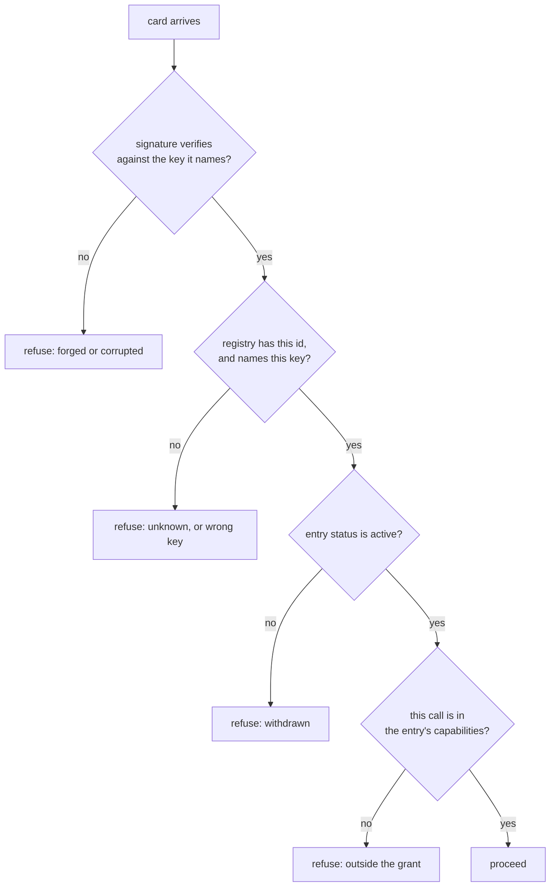

# 1.2 — The three questions a peer has to answer

## One-line answer

*Who are you*, *who says so*, and *what may you do* are three separate questions with three separate
answers stored in three different places, and collapsing any two of them into one is the mistake
every part of this day is a consequence of.

## The story

The visitor register at a gate, and the phone call upstairs.

Somebody arrives at an office building and says they are here to see the accounts department. The
guard does three things, in order, and they are not the same thing.

He asks for a card and looks at it — *who are you*. He picks up the phone and calls the fourth floor
to ask whether they are expecting anyone — *who says so*. And when the answer is yes, he writes out a
pass that says **fourth floor**, not one that opens the building — *what may you do*.

Every guard does all three and nobody thinks of it as three steps. But watch what happens when one is
dropped. Drop the first and anybody can claim to be anybody. Drop the second and a genuine card gets
a stranger inside. Drop the third and a legitimate visitor to accounts is standing in the server
room, holding a pass that says he is allowed to be.

## The idea in plain language

Here are the three questions, with the thing that answers each and the thing that answering it does
*not* get you.

**One — who are you? (authentication.)** Answered by a signature that checks out against a key. What
it gets you: confidence that the sender holds a particular private key. What it does not get you: any
opinion about whether that key is the right one. Part
[1.1](1.1-a-name-is-not-an-identity.md) is this question.

**Two — who says so? (the registry.)** Answered by a record, kept by you, that maps an identifier to a
key and says who vouched for it. What it gets you: the ability to turn *a key* into *the key we
expect for this peer*. What it does not get you: permission for anything. Sections
[2](../02-the-registry/2.1-the-list-behind-the-counter.md) and
[3](../03-keys-change/3.1-the-cheques-already-written.md) are this question.

**Three — what may you do? (authorisation.)** Answered by a capability list attached to the registry
entry and consulted **on every call**, not once at the start. What it gets you: a bounded blast
radius. What it does not get you: any assurance the peer is who it claims — that was question one.
Section [4](../04-verified-is-not-authorised/4.1-the-man-the-office-sent.md) is this question.

The order matters and the separation matters more. Each question is cheap to answer once the previous
one is settled, and each is impossible to answer correctly if the previous one is skipped.

Here is the same thing as a decision, which is what the lab implements:



Four gates, four refusals, four different reasons — and a system that reports "access denied" for all
four has thrown away the only useful part.

## Why Sutra needs it

Because the three questions map onto three different failures this repository has already met, and
seeing them as one thing is how they get confused. Day 68 built least-privilege tools — that is
question three. Day 63 built an approval gate for writes — that is question three again, with a human
in it. Nothing so far has answered questions one or two at all, because until Phase 14 every caller
was this repository's own code.

And because the answers live in different places with different lifetimes. A signature is decided in
microseconds from the document in front of you. A registry entry was decided weeks ago by a person and
may have changed since. A capability list is policy and changes when somebody's job changes. Code that
treats them as one lookup will cache the wrong one.

## The mechanism

`registry.py` asks the first two questions, in order, and returns the reason rather than a boolean:

```python
def resolve(agent_id: str, presented, key_id: str) -> tuple[bool, str]:
    """Three questions, in order. Any 'no' is a refusal, and the reason is the answer."""
    entry = REGISTRY.get(agent_id)
    if entry is None:
        return False, "no registry entry for this id"
    if entry["public_key"] != key_id:
        return False, f"registry expects {entry['public_key']}, card was signed by {key_id}"
    pub = KEYS.get(key_id)
    if pub is None or not signature_valid(presented.payload(), presented.signatures[0], pub):
        return False, "signature does not verify against that key"
    return True, f"vouched by {entry['vouched_by']}, capabilities {list(entry['capabilities'])}"
```

**Line by line:**

- The return type is `tuple[bool, str]`, not `bool`. Every refusal carries the reason it happened,
  because "refused" is an operational dead end and "the registry expects a different key" is a page in
  a runbook.
- `REGISTRY.get(agent_id)` — looked up by **id**, never by the card's `name`. The card's own name is
  never consulted in this function at all, which is part [1.1](1.1-a-name-is-not-an-identity.md)'s rule
  as code.
- The key check comes **before** the signature check, and the order is not an optimisation. Verifying
  a signature against whatever key the card points at answers "did this document's author sign it",
  which is always yes. Deciding *which* key you will accept first, and then verifying against that
  one, is what makes the check mean anything.
- `KEYS.get(key_id)` returning `None` is folded into the same refusal as a bad signature, because from
  the caller's side "we do not have that key" and "it did not verify" are both *not established*.
- The success string carries `vouched_by` and the capability list. Question two's answer and question
  three's input come back together, because they were both looked up in the same record.

Run it:

```bash
cd days/day-90-identity-and-registry/lab
uv run python registry.py; echo "exit: $?"
```

**Line by line:**

- No flag: a peer the registry knows, presenting a card signed with the key the registry names.

Measured on 2026-09-07:

```text
registry holds 3 agents
peer presents:  id=agent:refund-desk.example
                name='refund-desk', signed by key gTl3Dqh9F19W

  ACCEPTED  vouched by agent:registry.sutra.example, capabilities ['read_ticket', 'propose_refund']

  the id resolved, the key matched the entry, and the signature verified
exit: 0
```

Three facts on one line: **the id resolved**, **the key matched**, **the signature verified**. All
three had to hold, and the output names which — so a failure the next morning is attributable to one
of them rather than to "auth".

## When it breaks

The interesting failure is not a wrong answer to one of the three questions. It is answering one and
believing you have answered all three. Here is the second question failing on its own:

```bash
uv run python registry.py --unknown; echo "exit: $?"
```

Measured on 2026-09-07:

```text
peer presents:  id=agent:discount-bot.example
                name='refund-desk', signed by key gTl3Dqh9F19W

  REFUSED   no registry entry for this id

  a card that verifies against its own key proves only that its own key signed it
  the registry is what turns that into a name somebody vouched for
```

Read the two lines above the refusal carefully. **The card's signature is perfectly valid.** It is
signed by the real refund desk's key, it verifies, and question one is answered with a clean yes. The
refusal comes entirely from question two, and a system that only asked question one would have let it
through while being able to say, truthfully, that the signature checked out.

There is no error text for this class of mistake — there is a `200` and a conversation. Which is why
the four refusal branches in the diagram above each carry a distinct reason string, and why the
build brief asks for distinct exit codes rather than a boolean.

## In production

**What a professional does.** Keeps the three questions in three functions with three names, and
resists the helper that does all of them. The pressure to write `is_trusted(peer)` is enormous and it
is the single call that guarantees the three will drift into one — because whoever adds a fourth
consideration next quarter will add it wherever the boolean is computed.

**What degrades at scale.** Question two gets slow and question three gets complicated. The registry
becomes a network call, so it gets cached — and now the cache lifetime is the revocation delay, which
part [3.2](../03-keys-change/3.2-the-card-of-someone-who-left.md) is about. Meanwhile capabilities
grow from a list into a policy language, and the policy language is where question three quietly
becomes unauditable.

**The failure that only shows with real traffic.** A peer that passes all three questions and is
compromised afterwards. Nothing in this chain re-asks anything mid-conversation; a long-lived session
authorised at its start is authorised at its end. That is why question three is *per call* rather than
per session, and it is the single cheapest hardening available.

**The review comment a senior engineer leaves:** *"Split this. `verify_signature`, `resolve`, and
`allowed` — three functions, three call sites, three log lines. The combined helper reads better today
and in six months nobody will be able to say which of the three we actually check."*

**The interview question:** *"Walk me through accepting a request from another service."* The answer
that shows experience answers three questions in order and names what each does not establish. The
answer that does not says "we verify the token" and stops, which has answered one question out of
three and usually the least important one.

## Check yourself

```bash
cd days/day-90-identity-and-registry/lab
uv run python registry.py; echo "exit: $?"
uv run python registry.py --unknown; echo "exit: $?"
```

The second run refuses a card whose signature is perfectly valid. Say which of the three questions
failed and which two passed.

Now go back to the diagram and pick the branch that a system with no registry cannot reach at all.
There is more than one — name them, and say what a caller sees instead.

**Out loud, without scrolling up:** name the three questions, the artefact that answers each, and the
one thing each answer does **not** establish.

**Next:** [1.3 — The sticker anyone can print](1.3-the-sticker-anyone-can-print.md).
