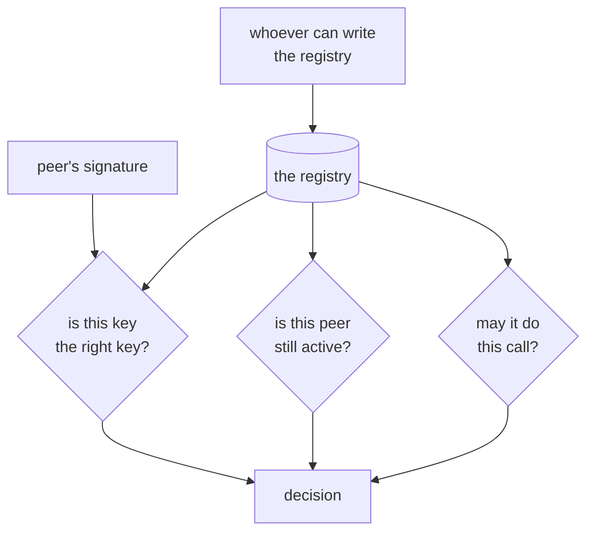

# 5.3 — The registry as a single point of trust

## One-line answer

Every check in this day ends at one record kept by one authority, so whoever can write that record can
grant themselves any identity and any capability — which makes the registry the most valuable thing in
the system and the one component nothing else can check.

## The story

The one road into town.

It is a good road. Tarred, wide enough, and it goes where everybody needs to go. Over the years the
market moved to be near it, then the school, then the clinic, because being on the road is worth more
than being anywhere else.

Nobody planned for it to be the only one. The others silted up or were never built, because the road
worked and building a second felt like solving a problem that did not exist.

Then it floods, one week in ten years, and the town discovers what it has been assuming. Not that the
road might fail — everybody knew that — but that **every arrangement made in the last twenty years had
quietly been built on it not failing.**

## The idea in plain language

Look back at what the whole day depends on. Part
[1.2](../01-what-an-identity-is/1.2-the-three-questions.md)'s three questions all terminate in the
registry: which key is right, is this peer still active, what may it do. The signature check is the only
step that does not, and it is the step that establishes the least.

So the registry is not one component among several. It is the root, and roots have two properties worth
naming.

**Whoever writes it decides everything.** An attacker who can add a row does not need to forge a
signature, guess a key, or find a bug in any of this day's code. They register their own key under an
id somebody will resolve, with whatever capability list they like, and every check in the system then
works perfectly on their behalf. All the cryptography holds. Part
[2.3](../02-the-registry/2.3-two-shops-one-name.md)'s lookalike was the accidental version of this; the
deliberate version needs write access and nothing else.

**Nothing downstream can detect a wrong entry.** A peer cannot tell you the registry is wrong about it;
that is the point of a registry. So a bad row is invisible to every consumer, indefinitely, and the only
control is on the writing side: who can write, what review a change gets, and whether the history is
recoverable.

This is where the day's paper diverges from practice, and it is worth being explicit because the paper
gets it half right. Its model assumes a certification authority whose statements are simply believed —
reasonable in 1991, and the assumption the field spent the following decades discovering was the weak
part. What survived is the *chain*: a request authorised by a sequence of statements each of which is
checked. What did not survive is the single trusted root at the top of that chain being taken for
granted.

## Why Sutra needs it

Because this repository goes public in three days, and a registry in a public repository is a document
anybody can read and a document whose write access is a pull request. That is not a weakness — a
reviewed diff is a genuinely good control — but it does mean the security of every peer relationship is
exactly the security of this repository's review process, and that sentence should be written down
somewhere before Day 92 rather than discovered during it.

And because the alternative is worse in the way that is easy to miss. A registry service with an API is
more convenient and moves the trust from "a reviewed commit" to "whoever holds the service's
credentials", which is usually fewer people with less scrutiny.

## The mechanism

There is no new code here. The mechanism is the dependency structure the earlier code already has, made
visible:



Three of the four inputs to the decision come from one box, and that box has exactly one input of its
own.

The control is therefore entirely on `W`, and it is worth writing down what it currently is:

```bash
cd days/day-90-identity-and-registry/lab
uv run python -c "import _ids; print(len(_ids.REGISTRY), 'entries'); print(sorted({e['vouched_by'] for e in _ids.REGISTRY.values()}))"
```

**Line by line:**

- A set comprehension over `vouched_by` rather than a list, so the output is the number of *distinct*
  authorities rather than the number of rows. That distinction is the measurement.

Measured on 2026-09-07:

```text
3 entries
['agent:registry.sutra.example']
```

**Three entries, one voucher.** Every peer in this system was admitted by the same authority, so
compromising that one authority compromises every peer relationship at once — and nothing anywhere in
the day's code could tell.

## When it breaks

There is no failing arm to run, and that is the finding: **a compromised registry produces no incorrect
behaviour anywhere.** Every consumer does exactly what it was designed to do, on data that is exactly
what it was told to trust. The system is not malfunctioning; it has been correctly reconfigured by
somebody who should not have been able to.

Two shapes, both worth recognising:

**The added row.** A new entry, with the attacker's key, under an id a caller will resolve. Every check
passes. This is indistinguishable from onboarding a peer, because it *is* onboarding a peer — the only
difference is who decided.

**The edited row.** An existing entry's `public_key` changed to the attacker's. Now the legitimate peer
starts being refused, which is the one version of this that produces a symptom — the real peer complains
that it cannot connect. That complaint is the detection mechanism, and it arrives as a support ticket
about connectivity rather than as a security alert, which is why it is usually resolved by "fixing" the
peer.

The composite has no code in it at all:

```text
1. the registry is a reviewed file; changes go through a pull request
2. it grows; changes become routine; reviews become approvals
3. a change adds one row among several in a busy diff
4. every check honours it, because that is what the checks are for
5. detection depends on someone reading the diff, and the diff was approved
```

Step two is the whole failure and it is a social process rather than a technical one. That is why the
mitigation in the next section is about the shape of the change rather than about the code.

## In production

**What a professional does.** Makes registry changes small, isolated and boring. A pull request that
touches the registry touches *only* the registry, so it cannot ride along with a hundred lines of
unrelated work — that single rule does more than any amount of tooling. Beyond it: a second approver for
anything granting a dangerous capability, and an alert on the file changing at all, because a registry
change is rare enough that noticing every one is affordable.

**What degrades at scale.** The single voucher stops being tenable. Once peers come from more than one
organisation, one authority cannot vouch for all of them and federation arrives: two registries that
trust each other's statements, which is part [5.2](5.2-what-a-real-identity-layer-adds.md)'s parked item
8. Federation replaces one root with a small number of roots, which is better and is not the same as
having none — the question becomes which roots, and that question never fully closes.

**The failure that only shows with real traffic.** A registry that is also the discovery mechanism. Part
[2.1](../02-the-registry/2.1-the-list-behind-the-counter.md) said these should be separate; at scale the
pressure to merge them is enormous, because a peer that can find you should surely be able to register
with you. The moment registration is self-service, `W` is the entire internet, and every check in this
day is being performed against data the caller supplied.

**The review comment a senior engineer leaves:** *"Registry changes go in their own pull request, nothing
else in the diff, and a capability that moves money needs a second approver. We are protecting a file
that decides who may spend money, and right now it is protected by the same process as a typo fix."*

**The interview question:** *"Where is the trust root in your system?"* The answer that shows experience
can name it in one sentence, says who can modify it, and — the part that separates people who have
thought about it from people who have read about it — says how they would find out if somebody did.

## Check yourself

```bash
cd days/day-90-identity-and-registry/lab
uv run python -c "import _ids; print(len(_ids.REGISTRY), 'entries'); print(sorted({e['vouched_by'] for e in _ids.REGISTRY.values()}))"
```

One voucher. Now add a row to `REGISTRY` in `_ids.py` with your own fingerprint and
`capabilities: ("move_money",)`, and run `uv run python registry.py` against that id. Say which check
refuses it. Then remove the row.

Nothing refused it, and that is the answer. Say in one sentence why no amount of improving the code in
this lab would change that.

**Out loud, without scrolling up:** three of the four inputs to an accept-or-refuse decision come from
one place. Name it, name who can write it, and say how you would detect that somebody had.

**Next:** the paper this whole day rests on —
[Speaks for: authentication as a chain of statements](../../papers/01-speaks-for.md).
