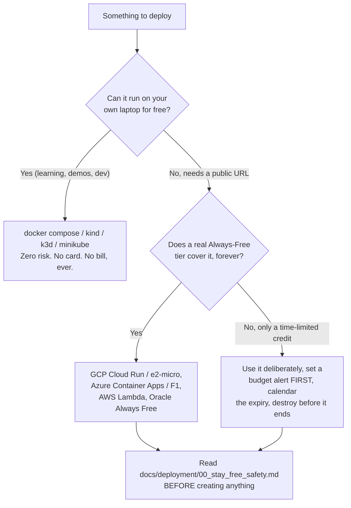

# Free-tier deployment guide — GCP · Azure · AWS · Kubernetes · Terraform · other platforms

> **Scope of this folder.** This is a general-purpose, provider-by-provider reference for
> deploying an LLM-backed agent (Sutra, or anything shaped like it: a container with an HTTP
> API) to real cloud infrastructure **without spending money**. It is broader than the
> curriculum: [day_086.md](../days/day_086.md), [day_087.md](../days/day_087.md) and
> [day_088.md](../days/day_088.md) already teach the Sutra-specific, GCP-only deployment path
> (Docker Compose → parked Agent Runtime walkthrough → `kind` Kubernetes), and their own
> deliverable is `docs/DEPLOY.md` (not yet created — it is written *by those days, as they are
> run*, from hands-on measurements). **This folder does not replace or pre-fill that file.**
> It exists to also cover Azure, AWS, Terraform, and non-cloud free platforms, which the
> curriculum intentionally does not — Sutra only needs one deployment story, but a request to
> document "all possible free options" is a bigger, standalone reference.
>
> Every page here follows the same rule this repo already uses for the master plan
> (Principle 7/8): **numbers and commands are either verified against the provider's own docs
> on the date stated, or explicitly marked "verify before relying on this."** Free tiers move —
> Google cut Gemini's free quota in Dec 2025 with little warning, and this folder's own research
> (2026-08-21) found that Fly.io's free allowance is gone and Hugging Face Spaces now requires a
> paid plan to create a Docker Space. Re-check before you build on any specific figure.

---

## 0 · The one rule that matters more than any provider choice

**Local-first, always-free-tier second, time-limited trial third — and never let a cloud
command be a *required* step.** This mirrors `docs/02_ADDENDUM_ZERO_BUDGET_MODELS.md` §5's own
policy for Days 86–88 (Cloud Run and Agent Runtime are documented, never run; `kind` is run,
because it is genuinely free). The same ladder applies to every provider in this folder:

Read **[00_stay_free_safety.md](00_stay_free_safety.md)** before you run a single cloud
command from any other file in this folder. It is not optional reading — "free tier" and
"cannot be charged" are not the same claim, on any provider.

## 1 · What "free" actually means (the distinctions that cost people money)

| Category | What it means | Risk | Examples in this folder |
| --- | --- | --- | --- |
| **Always Free** | A quota that renews every month, with no end date, whether or not you ever pay for anything else | Low — but only *below* the quota; the same service becomes normal pay-as-you-go the moment you cross it | GCP Cloud Run (2M requests/mo), AWS Lambda (1M requests/mo), Azure Container Apps (180,000 vCPU-s/mo), Oracle Cloud's Arm compute pool |
| **N-months-free / new-customer credit** | A fixed credit or elevated quota that expires on a date, usually 12 months or 30 days from signup | Medium — the bill resumes silently the day it expires unless you destroy the resource or downgrade first | GCP's $300/30-day credit, Azure's $200/30-day + "12 months free" services, AWS's classic 12-Months-Free EC2/RDS/S3 |
| **Free tier of a fundamentally paid service** | The provider waives *one* component (e.g. a control plane) but the thing you actually run still bills normally | High if you don't read the fine print | GKE/AKS: cluster *management* is free, the *nodes* are ordinary VMs and are not |
| **Marketing "free" that requires a card and bills per second** | No real free allowance; a time-boxed trial only | High — this folder found one during research (§below) | Fly.io, as of 2026-08-21 (see [06_other_free_platforms.md](06_other_free_platforms.md)) |

## 2 · Decision table — "I want to…"

| Goal | Recommended path | Why |
| --- | --- | --- |
| Learn Kubernetes, run Sutra-shaped manifests, iterate fast | `kind` or `k3d` on your laptop ([01_local_docker_and_kubernetes.md](01_local_docker_and_kubernetes.md)) | Genuinely $0, no account, no card, no expiry — the same path Day 88 already takes |
| Put a container behind a public HTTPS URL, low/bursty traffic | GCP Cloud Run **or** Azure Container Apps consumption plan | Both have a real, renewing, no-time-limit free request/compute allowance (verified 2026-08-21, §3) |
| Run small event-driven functions (webhooks, cron-style jobs) | AWS Lambda **or** Azure Functions Consumption | Both have an Always-Free monthly grant that does not expire |
| Run a real, persistent Linux VM 24/7, forever, at zero cost | **Oracle Cloud Always Free** (Ampere A1 Arm VM) | The single most generous permanent free compute of any major provider — see [06_other_free_platforms.md](06_other_free_platforms.md) |
| Practice Terraform without touching a cloud account | Terraform against `kind`/Docker locally, or the `null`/`local` providers | [05_terraform.md](05_terraform.md) §2 |
| Demo a running agent to someone else, briefly, without deploying anywhere | `kubectl port-forward` / `docker compose` + a free tunnel (ngrok or Cloudflare Tunnel) | [06_other_free_platforms.md](06_other_free_platforms.md) — zero infrastructure, torn down when you close the terminal |
| See real multi-cloud Kubernetes control-plane billing rules | [02_gcp.md](02_gcp.md) §GKE, [03_azure.md](03_azure.md) §AKS, [04_aws.md](04_aws.md) §EKS | GKE/AKS waive the control-plane fee; **EKS does not** ($0.10/hr) — this is the single biggest AWS trap for this project |
| Persist agent data (sessions, memory) past a restart, on serverless/scale-to-zero compute | **Neon** (Postgres) or **Upstash** (Redis) | [07_free_databases_and_extras.md](07_free_databases_and_extras.md) — both are genuinely free forever, no card required, unlike every cloud VM/container option above |

## 3 · Provider comparison matrix (verified 2026-08-21 unless noted)

| | **GCP** | **Azure** | **AWS** | **Oracle Cloud** |
| --- | --- | --- | --- | --- |
| Card required to sign up? | Yes | Yes | Yes | Yes (identity check only for Always Free) |
| New-account credit | $300 / 30 days | $200 / 30 days | none currently offered the same way (⚠️ not verified live, see [04_aws.md](04_aws.md)) | $300 / 30 days |
| Genuine Always-Free compute (renews forever) | 1× `e2-micro` VM/month | Azure Container Apps: 180,000 vCPU-s + 360,000 GiB-s + 2M requests/month | AWS Lambda: 1M requests + 400,000 GB-s/month (⚠️ recalled, verify) | 2× AMD micro VMs **+** Arm Ampere A1 pool (the biggest of the four) |
| Free managed container/serverless | Cloud Run: 2M requests/month | Container Apps (same grant as above) | Lambda (same grant as above) | — (use the Always-Free VM directly) |
| Kubernetes control-plane cost | Free (1 Autopilot/Zonal cluster/month) | Free (AKS management always free) | **$0.10/hour (~$73/mo) — NOT free** | Free (OKE) — nodes on the Always-Free VMs are $0 |
| Best zero-risk local emulator | `kind`/`k3d` (identical API either way) | same | same | same |
| Recommended for "keep something running 24/7 for $0" | Not ideal (`e2-micro` is small; Cloud Run scales to zero, so it's *not* "always on") | Not ideal (same shape as GCP) | Not ideal (12-month EC2 clock runs out) | **Best choice** — Always Free has no 12-month clock |

## 4 · File index

| File | Covers |
| --- | --- |
| [00_stay_free_safety.md](00_stay_free_safety.md) | **Read first.** Budget alerts, the "always destroy after testing" habit, the resources that are rarely free on any provider |
| [01_local_docker_and_kubernetes.md](01_local_docker_and_kubernetes.md) | Docker Compose, `kind`, `k3d`, `minikube` — generic manifests explained line by line, exposing a local cluster for a demo |
| [02_gcp.md](02_gcp.md) | Compute Engine `e2-micro`, Cloud Run, Cloud Run functions, GKE, Agent Runtime (a.k.a. Agent Engine), Terraform for GCP |
| [03_azure.md](03_azure.md) | Container Apps, App Service (F1), Azure Functions, AKS, Container Instances, Terraform for Azure |
| [04_aws.md](04_aws.md) | Lambda, EC2 free tier, EKS (and why to avoid it here), Fargate/App Runner, Elastic Beanstalk, Terraform for AWS |
| [05_terraform.md](05_terraform.md) | Install, `init`/`plan`/`apply`/`destroy` explained, state management, a full worked example per cloud, cost-safety practices |
| [06_other_free_platforms.md](06_other_free_platforms.md) | Oracle Cloud Always Free, Render, Hugging Face Spaces (with the 2026 paid-plan caveat), Cloudflare, GitHub Actions/Codespaces, ngrok/Cloudflare Tunnel, and why Fly.io is flagged out |
| [07_free_databases_and_extras.md](07_free_databases_and_extras.md) | Neon (free Postgres, no card), Supabase (Postgres+Auth+Storage, with its 1-week-pause caveat), Upstash (free Redis, incl. an instant no-signup instance), MongoDB Atlas M0, Vercel Hobby — the data layer that survives a restart when your compute scales to zero |

## 5 · How this relates to Sutra's own curriculum

Sutra's zero-budget policy (`docs/02_ADDENDUM_ZERO_BUDGET_MODELS.md`) already commits to
**never requiring a paid model, billing account, or cloud spend** as part of the 96-day plan.
Days 86–88 satisfy that by containerizing locally and running Kubernetes via `kind`. This
folder does not change that plan or reopen closed/planned days — it is supplementary reference
material for deploying *any* container-shaped agent (Sutra or otherwise) to whichever provider
you actually have access to, while keeping the same zero-spend discipline the rest of the repo
already holds itself to.
